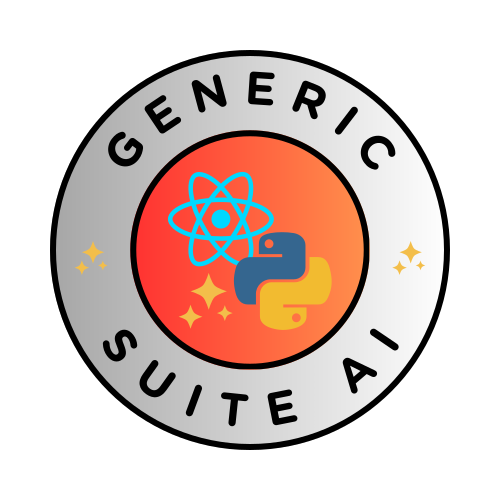

# GenericSuite AI for ReactJS



GenericSuite AI (frontend version) has AI ChatBot tools, a customizable CRUD editor, login interface and a suite of tools to kickstart your AI App development process.

## Features

- **AI ChatBot tools:** to implement Chatbot conversations base on NLP (Natural Language Processing), LLM (Large Language Models) and other AI technologies like ChatGPT.
- **Customizable CRUD editor:** core CRUD (Create-Read-Update-Delete) code that can be parametrized and extended by JSON configuration files. There's no need to rewrite code for each table editor.
- **Customizable menu:** menu and endpoints can be parametrized and extended by JSON configuration files in the backend side. The API will supply the menu estructure and security check based on the user's security group, and GenericSuite will draw the menu and available options.
- **Customizable Login Interface:** Easily adapt the login page to match your brand identity with the App logo.
- **Development and Production Scripts:** Quick commands to start development or build your application for QA, staging production environments on AWS.
- **Testing with Jest:** Comes pre-configured with Jest for running tests, including an initial test for the `<App />` component.
- **Inclusion of Essential Files:** `.env.example` for environment variables setup, `Makefile` to short-cut frequent operations, `webpack.config.js` and `config-overrides.js` to run the App locally with `Webpack` or `react-app-rewired`, `scripts` with development and production scripts, 
 and `CHANGELOG.md` for tracking changes across versions.

The perfect companion for this frontend solution is the [backend version of The GenericSuite AI](../../Backend-Development/GenericSuite-AI/index.md).

GenericSuite AI (frontend version) is based on [The GenericSuite for ReactJS (frontend version)](../GenericSuite-Core/index.md).

## Pre-requisites

Install same tools described in [GenericSuite for ReactJS (frontend version)](../GenericSuite-Core/index.md#pre-requisites) `Pre-requisites` section.

## Getting Started

To get started with GenericSuite AI, follow these simple steps:

### Create Git repositories

Same steps described in [GenericSuite for ReactJS (frontend version)](../GenericSuite-Core/index.md#create-git-repositories) `Getting started > Create Git repositories` section.

### Initiate your project

Same steps described in [GenericSuite for ReactJS (frontend version)](../GenericSuite-Core/index.md#initiate-your-project) `Getting started > Initiate your project` section.

### Install GenericSuite AI Library

```bash
npm install genericsuite genericsuite-ai
```

### Install additional development dependencies

Same steps described in [GenericSuite for ReactJS (frontend version)](../GenericSuite-Core/index.md#install-additional-development-dependencies) `Getting started > Install additional development dependencies` section.

### Prepare the Configuration Files

Copy the template from `node_modules/genericsuite-ai`:

```bash
cp node_modules/genericsuite-ai/.env.example ./.env
```

And configure the variables according your needs:

1. Assign the same variables described in described in [GenericSuite for ReactJS (frontend version)](../GenericSuite-Core/index.md#prepare-the-configuration-files) `Getting started > Prepare the Configuration Files` section.

2. Assign the additional `AWS_*` parameters with your AWS data (used by aws_deploy_to_s3.sh and change_env_be_endpoint.sh). You'll need an AWS account.

For more information, check the comments for each variable in the [.env.example](https://github.com/tomkat-cr/genericsuite-fe-ai/blob/main/.env.example) file.

### Prepare the Makefile

Copy the `Makefile` template from `node_modules/genericsuite-ai`:

```bash
cp node_modules/genericsuite-ai/Makefile ./Makefile
```

### Change Scripts in Package.json

Same steps described in [GenericSuite for ReactJS (frontend version)](../GenericSuite-Core/index.md#change-scripts-in-packagejson) `Getting started > Change Scripts in Package.json` section.


### Create the version file

Create the `version.txt` file with the App version:

```bash
vi ./version.txt
# or
# code ./version.txt
```

Add the version number (e.g. `1.0.0`) and save the file.


## App structure

The suggested App development repository structure is the same described in [GenericSuite for ReactJS (frontend version)](../GenericSuite-Core/index.md#app-structure) `App structure` section.


## Configure the project

Click [here](../../Configuration-Guide/index.md) for more information about how to configure the project.

## Code examples and JSON configuration files

The main menu, API endpoints and CRUD editor configurations are defined in the JSON configuration files.

You can find examples about configurations and how to code an App in the [GenericSuite App Creation and Configuration guide](../../Configuration-Guide/index.md).

## Usage

### Start Development Server

To start the development server:

```bash
make run
```

### Deploy QA

Check the [Deployment Guide](../deployment.md) for details.