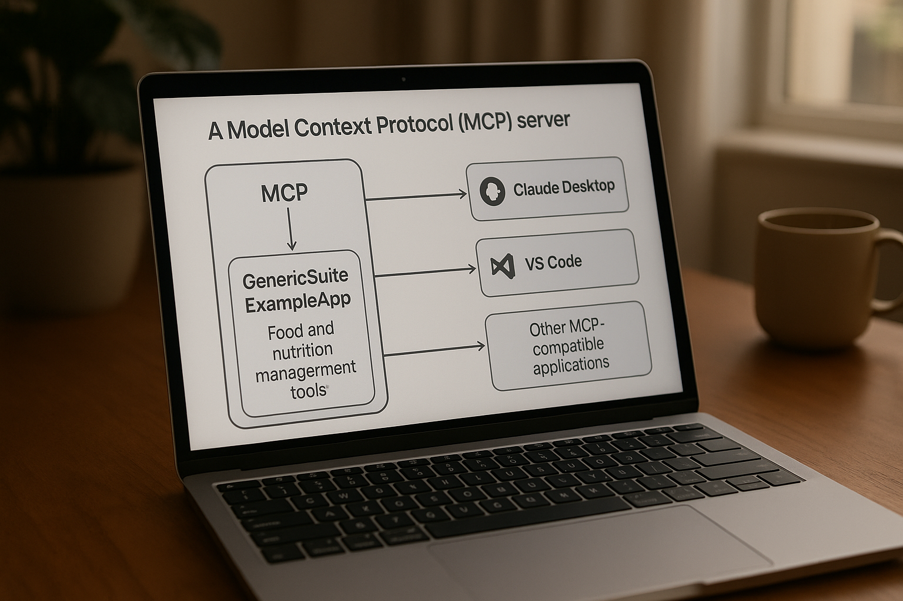

# ExampleApp MCP Server



A Model Context Protocol (MCP) server that exposes the GenericSuite ExampleApp food and nutrition management tools to AI clients like Claude Desktop, VS Code, and other MCP-compatible applications.

## Features

This MCP server provides comprehensive food and nutrition management capabilities:

### 🔍 FDA Food Database Integration
- `get_fda_food_query`: Search FDA food database for nutritional information

### 🥘 User Ingredient Management  
- `create_user_ingredient`: Add new ingredients to personal list
- `search_user_ingredient`: Search ingredients by name
- `get_user_ingredient_list`: Get all saved ingredients

### 🍽️ Dish Management
- `create_dish`: Create dishes with multiple ingredients
- `search_dishes`: Search dishes by name  
- `get_dishes_list`: Get all created dishes

### 📅 Daily Meal Tracking
- `create_daily_meal`: Add daily meal entries
- `search_daily_meals`: Search meals by date
- `get_daily_meal_list`: Get meal history

### 👤 User Profile & Health
- `get_user_profile`: Get basic health profile
- `get_full_user_profile`: Get complete profile with eating habits

### 📂 Resources
- `user://profile`: User profile data
- `user://ingredients`: User ingredients data  
- `user://dishes`: User dishes data
- `user://meals`: User meals data

### 📝 Prompts
- `nutrition_analysis`: Generate nutrition analysis
- `meal_planning`: Generate meal planning advice

## Installation

1. **Install Python dependencies:**
   ```bash
   cd site/Sample-Code/exampleapp/apps/mcp-server
   pip install -r requirements.txt
   ```

2. **Run the server:**
   ```bash
   python mcp_server.py
   ```

## MCP Client Configuration

### Claude Desktop

Add this configuration to your `claude_desktop_config.json`:

```json
{
  "mcpServers": {
    "exampleapp-nutrition": {
      "command": "sh /absolute/path/to/genericsuite-basecamp/docs/Sample-Code/exampleapp/apps/mcp-server/run_mcp_server.sh"
    }
  }
}
```

### VS Code MCP Extension

Add to your VS Code settings or `.vscode/mcp.json`:

```json
{
  "mcp": {
    "servers": {
      "exampleapp-nutrition": {
        "command": "sh /absolute/path/to/genericsuite-basecamp/docs/Sample-Code/exampleapp/apps/mcp-server/run_mcp_server.sh"
      }
    }
  }
}
```

## Usage Examples

Once connected to an MCP client, you can interact with the server using natural language:

### Basic Operations
- "Search for apple in the FDA database"
- "Add quinoa to my ingredients list with 368 kcal per 100g"
- "Create a new dish called 'Healthy Breakfast' with Greek yogurt and berries"

### Daily Meal Tracking
- "Add a breakfast meal for today with 2 eggs and toast"
- "What did I eat yesterday?"
- "Show me my total calories for 2024-01-15"

### Profile and Analysis
- "Show me my nutrition profile"
- "Analyze my eating patterns from last week"
- "Give me meal planning suggestions for weight loss"

## Architecture

The server is built using:
- **FastMCP**: Modern Python MCP framework for rapid development
- **Pydantic**: Data validation and serialization
- **AsyncIO**: Asynchronous operations for better performance

### Data Models
- Comprehensive validation for all nutritional data
- Support for various measurement units (grams, ounces, cups, etc.)
- Automatic calorie calculations for recipes and meals

### Mock Data
The server includes sample data for testing and demonstration:
- Sample ingredients (quinoa, Greek yogurt, almonds)
- Sample dishes (yogurt with almonds)
- FDA food database entries (apple, chicken breast, rice)

## Development

### Extending the Server
To add new tools, create functions decorated with `@mcp.tool()`:

```python
@mcp.tool()
async def my_new_tool(params: MyModel) -> Dict[str, Any]:
    """Description of what this tool does"""
    # Implementation
    return {"success": True, "data": result}
```

### Adding Resources
To add new resources, use the `@mcp.resource()` decorator:

```python
@mcp.resource("mydata://endpoint")
async def my_resource() -> str:
    """Get my data as a resource"""
    data = await get_my_data()
    return json.dumps(data, indent=2)
```

## Integration with GenericSuite's ExampleApp

This MCP server is based on the ExampleApp's AI tools:
- `ai_gpt_fn_app.py`: Core food and nutrition tools
- `ai_gpt_fn_fda.py`: Food database integrations

It provides the same functionality but exposed through the standardized MCP protocol, making it accessible to any MCP-compatible AI client.

## Transport Modes

Currently supports:
- **STDIO**: Standard input/output for local clients (default)
- **Future**: HTTP/SSE transport for remote clients (planned)

## Logging

The server provides detailed logging for debugging and monitoring:
- Tool invocations and parameters
- Data validation errors
- Mock database operations
- Performance metrics

## License

This MCP server follows the same license as the GenericSuite project.