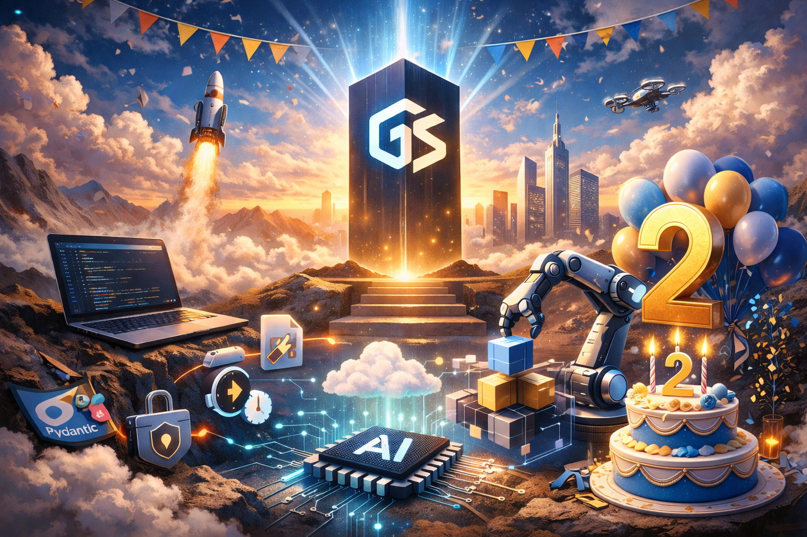

# Desbloquea el poder full-stack con Generic Suite (GS)

Generic Suite (GS) es la biblioteca de desarrollo definitiva diseñada para agilizar los flujos de trabajo de frontend y backend, permitiendo un desarrollo rápido de aplicaciones con mejoras impulsadas por IA. Ya sea que estés construyendo APIs robustas, bases de datos escalables o interfaces de usuario dinámicas, GS ofrece la flexibilidad y la eficiencia necesarias para acelerar tus proyectos.

[Notas de lanzamiento](./Releases/index.md) | [Código de muestra](./Sample-Code/index.md) | [Repositorios](./repositories.md)

Nos enorgullece anunciar el [Lanzamiento de GenericSuite 20260218 - La 2.ª Edición Aniversario](./Releases/GS_Release_2026-02-18_Changelog.md)

## Comenzar

Únete a la creciente comunidad de desarrolladores que usan Generic Suite para potenciar sus proyectos. Explora los repositorios y empieza a construir hoy.

* [¿Por qué elegir Generic Suite?](#why-choose-generic-suite)
* [Características clave](#key-features)
* [¿Para qué sirve Generic Suite?](#what-is-the-generic-suite-for)
* [El Núcleo de Generic Suite](#the-generic-suite-core)
* [IA de Generic Suite](#the-generic-suite-ai)
* [Código de muestra](#sample-code)
* [Repositorios](#repositories)
* [Lanzamientos](#releases)
* [Presentación](#presentation)
* [Publicaciones](#posts)
* [Desarrollo Frontend](./Frontend-Development/index.md)
* [Desarrollo Backend](./Backend-Development/index.md)
* [Guía de Configuración](./Configuration-Guide/index.md)
* [Historia](./history.md)

## ¿Por qué elegir Generic Suite?

* Integración full-stack sin fisuras: Desarrolla aplicaciones más rápido con una biblioteca unificada tanto para frontend como para backend, reduciendo código redundante y asegurando consistencia.
* Eficiencia impulsada por IA: aprovecha las capacidades de IA integradas para mejorar la automatización, generar contenido y optimizar el desarrollo de software.
* Personalizable y escalable: adapta el marco a tus necesidades específicas, con soporte para múltiples frameworks de programación, bases de datos y plataformas de despliegue.
* Flujo de desarrollo acelerado: utilidades y herramientas de automatización preconstruidas ahorran tiempo, permitiéndote centrarte en la innovación en lugar de tareas repetitivas.
* Compatibilidad multiplataforma: ya sea que trabajes con FastAPI, Flask, Chalice, MongoDB, DynamoDB, Postgres, MySQL, Supabase, GS se adapta a tu pila tecnológica sin esfuerzo.

## Características clave

### Núcleo del Framework

* Editor CRUD personalizable, generador de menús e interfaz de inicio de sesión.
* Generador de bases de datos y endpoints de API genéricos para eliminar código redundante.
* Abstracción del framework de backend que admite FastAPI, Flask y Chalice.
* Abstracción de bases de datos para MongoDB, DynamoDB, Postgres, MySQL y Supabase con una sintaxis de consulta unificada.
* Despliegue sencillo con AWS y otros servicios en la nube.

### Desarrollo impulsado por IA

* Endpoint de chatbot de IA con integraciones de OpenAI, LangChain y Hugging Face.
* Visión por computadora, procesamiento de voz y capacidades de texto a voz.
* Web scraping, herramientas de traducción y búsqueda vectorial para un manejo avanzado de datos.

### GSAM: El Generador de Aplicaciones de Generic Suite

* Ideación asistida por IA para el desarrollo de apps, generación de código y estructuración de bases de datos.
* Generación de imágenes y videos utilizando modelos de IA de última generación.
* Presentaciones de apps impulsadas por IA, sugerencias de nombres y ingeniería de prompts.

### ASDT (Equipo de Desarrollo de Software Agentico)

* Colaboración de IA multiagente para la resolución de problemas y la automatización de software.
* Construido sobre CrewAI, Camel AI, LangGraph y Smolagent para flujos de trabajo agenticos escalables.

### DevOps y Despliegue sin esfuerzo

* Scripts de GitOps preconfigurados para Kubernetes, Docker y entornos VPS.
* Configuraciones de servicios de IA locales, que incluyen OLLAMA, WebUI, Stable Diffusion y N8N.
* Documentación completa y buenas prácticas a través de Generic Suite Basecamp.

## ¿Para qué sirve Generic Suite?

El Generic Suite es un conjunto de utilidades de frontend y backend hechas con ReactJS y Python para ayudar a desarrollar aplicaciones más rápido.

Está compuesto por un **Núcleo de Generic Suite**, que es el núcleo para todos los elementos de la suite, y extensiones como la IA de Generic Suite.

## El Núcleo de Generic Suite

Características:

* Editor CRUD personalizable, generador de menús, interfaz de inicio de sesión personalizable, despliegue a AWS y un conjunto de herramientas para iniciar el proceso de desarrollo frontend.
* Base de datos CRUD genérica y endpoints de API: al disponer de un código central de Create-Read-Update-Delete que puede parametrizarse y ampliarse, no es necesario reescribir código para cada editor de tablas.
* Generador genérico de menús y endpoints de API.
* Abstracción de bases de datos: el backend puede usar MongoDB, DynamoDB, Postgres, MySQL o Supabase como almacenamiento persistente, implementando una sintaxis similar a MongoDB.
* Abstracción de frameworks: admite varios frameworks, incluidos FastAPI, Flask y Chalice, haciéndolo adaptable a una variedad de proyectos.
* [Utilidades](./Backend-Development/GenericSuite-Scripts/index.md), y [Configuraciones](./Configuration-Guide/index.md) necesarias para construir y desplegar aplicaciones escalables y mantenibles.

Paquetes:

* :fontawesome-brands-react:{ .react } [GenericSuite Core (versión frontend) para React.js](./Frontend-Development/GenericSuite-Core/index.md)
* :fontawesome-brands-python:{ .python } [GenericSuite Core (versión backend) para Python](./Backend-Development/GenericSuite-Core/index.md)
* :fontawesome-brands-linux:{ .linux } [GenericSuite Scripts (versión backend)](./Backend-Development/GenericSuite-Scripts/index.md)

## La IA de Generic Suite

La **IA de Generic Suite** es una extensión para ayudar a desarrollar Apps que implementan IA.

Características:

* Endpoint de agente de IA para implementar conversaciones tipo chatbot NLP.
* OpenAI GPT, Google Gemini, Anthropic Claude, Meta Llama, Hugging Face, xAI, IBM WatsonX y muchos otros modelos compatibles.
* API de OpenAI, API de Google, API de Anthropic, Hugging Face, Together AI, OpenRuter, API de IA/ML, Ollama, Clarifai y otros proveedores de LLM.
* Visión por computadora (OpenAI GPT4 Vision, Google Gemini Vision, Clarifai Vision).
* Procesamiento de voz a texto (OpenAI Whisper, Clarifai Audio Models).
* Texto a voz (OpenAI TTS-1, Clarifai Audio Models).
* Generador de imágenes (OpenAI DALL-E 3, Google Gemini Image, Clarifai Image Models).
* Indexadores vectoriales (FAISS, Chroma, Clarifai, Vectara, Weaviate, MongoDBAtlasVectorSearch).
* Embeddings (OpenAI, Hugging Face, Bedrock, Cohere, Ollama, Clarifai).
* Herramienta de búsqueda en la web.
* Raspado y análisis de páginas web.
* Lectores de JSON, PDF, Git y YouTube.
* Herramientas de traducción de idiomas.
* Chats almacenados en la base de datos.
* Plan de usuario, clave API de OpenAI y atributos de nombre de modelo en el perfil del usuario, para permitir que los usuarios del plan gratuito utilicen modelos a su propio costo.

Paquetes:

* :fontawesome-brands-react:{ .react } [GenericSuite AI (versión frontend) para React.js](./Frontend-Development/GenericSuite-AI/index.md)
* :fontawesome-brands-python:{ .python } [GenericSuite AI (versión backend) para Python](./Backend-Development/GenericSuite-AI/index.md)
* :fontawesome-brands-linux:{ .linux } [GenericSuite Scripts (versión backend)](./Backend-Development/GenericSuite-Scripts/index.md)

### GSAM: El Generador de Aplicaciones de Generic Suite

La **Generador de Aplicaciones de Generic Suite (GSAM)** es la herramienta de IA para mejorar la ideación del desarrollo de software y probar modelos de IA, proveedores de LLM y sus características. También permite generar descripciones, estructuras de bases de datos, imágenes, videos o respuestas a partir de un prompt de texto, y generar código de inicio para usar con la biblioteca Generic Suite.

Repositorio:

* :fontawesome-brands-python:{ .python } [Generador de Aplicaciones de GenericSuite](https://github.com/tomkat-cr/genericsuite-app-maker)

### Equipo de Desarrollo de Software Agentico de Generic Suite (ASDT)

El **Equipo de Desarrollo de Software Agentico de Generic Suite (ASDT)** ofrece un equipo de entidades autónomas diseñadas para resolver problemas de desarrollo de software usando IA para tomar decisiones, aprender de las interacciones y adaptarse a condiciones cambiantes sin intervención humana.

Repositorio:

* :fontawesome-brands-python:{ .python } [Equipo de Desarrollo de Software Agentico de GenericSuite](https://github.com/tomkat-cr/genericsuite-asdt-be)

## Operaciones del Servidor

El **Generic Suite Gitops** proporciona los scripts y configuraciones necesarias para desplegar en diversas plataformas (servidores de desarrollo locales, VPS) utilizando tecnologías de orquestación como Kubernetes, y gestionar artefactos y repositorios con Docker y GitHub.

Repositorio:

* :fontawesome-brands-linux:{ .linux } [GenericSuite Gitops (Operaciones del servidor de desarrollo local)](https://github.com/tomkat-cr/genericsuite-gitops)

## Repositorios

[Haz clic aquí](./repositories.md) para revisar los repositorios de Git, paquetes de NPMJS y PyPI.

## Documentación

* Principal: [https://genericsuite.carlosjramirez.com](https://genericsuite.carlosjramirez.com)
* Espejo: [https://genericsuite.readthedocs.io](https://genericsuite.readthedocs.io)

## Código de muestra

Tenemos un [EjemploApp](../code/exampleapp/README.md) para mostrarte cómo usar las bibliotecas de GenericSuite.

[EjemploApp](../code/exampleapp/README.md) es una aplicación de ejemplo completa construida como un monorepo utilizando Turborepo y pnpm. Esto proporciona un plano práctico y del mundo real para que los desarrolladores aprendan de él y aceleren sus propios proyectos. Hay un frontend en React y backends en Python, utilizando los 3 frameworks principales: FastAPI, Flask y Chalice.

También tenemos una [Plantilla FastAPI](../code/fastapitemplate/README.md) para ayudarte a empezar con backends basados en FastAPI.

Consulta la sección [Código de muestra](./Sample-Code/index.md) para más información.

## Lanzamientos

Puedes encontrar el registro detallado de cambios de cada versión [aquí](./Releases/index.md).

## Presentación

Inglés:

* [Introducción a Generic Suite](https://raw.githubusercontent.com/tomkat-cr/genericsuite-basecamp/main/docs/en/documents/GS_Presentation_EN_V2.pdf)

Español:

* [Introducción a Generic Suite](https://raw.githubusercontent.com/tomkat-cr/genericsuite-basecamp/main/docs/es/documents/GS_Presentation_SP_V2.pdf)

## Publicaciones

X: [@genericsuitelib](https://twitter.com/genericsuitelib)

Inglés:

* [https://www.carlosjramirez.com/genericsuite](https://www.carlosjramirez.com/genericsuite)

Español:

* [https://www.carlosjramirez.com/genericsuite-es/](https://www.carlosjramirez.com/genericsuite-es/)

## Licencia

Generic Suite es software de código abierto licenciado bajo la licencia [ISC](https://github.com/tomkat-cr/genericsuite-basecamp/blob/main/LICENSE).

## Créditos

Este proyecto es desarrollado y mantenido por [Carlos Ramirez](https://www.carlosjramirez.com). Para más información o para contribuir al proyecto, visita [GenericSuite en GitHub](https://github.com/stars/tomkat-cr/lists/genericsuite).

## Política de Privacidad

[Haz clic aquí](./privacy-policy.md) para revisar la política de privacidad.

¡Feliz codificación!