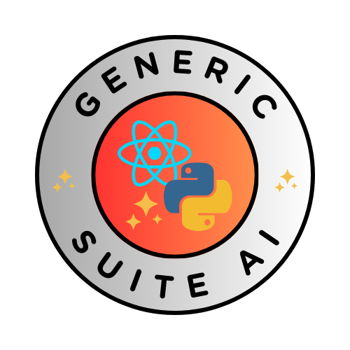

# Desbloquea el Poder Full-Stack con Generic Suite (GS)

Generic Suite (GS) es la biblioteca de desarrollo definitiva diseñada para optimizar flujos de trabajo de frontend y backend, permitiendo un desarrollo rápido de aplicaciones con mejoras impulsadas por IA. Ya sea que estés construyendo APIs robustas, bases de datos escalables o interfaces de usuario dinámicas, GS ofrece la flexibilidad y eficiencia necesarias para acelerar tus proyectos.

[Notas de la versión](./Releases/index.md) | [Código de muestra](./Sample-Code/index.md) | [Repositorios](./repositories.md)

## Comienza

Únete a la creciente comunidad de desarrolladores que utilizan Generic Suite para potenciar sus proyectos. Explora los repositorios y empieza a construir hoy.

- [¿Por qué elegir Generic Suite?](#por-qué-elegir-generic-suite)
- [Características Clave](#características-clave)
- [¿Para qué sirve Generic Suite?](#para-qué-sirve-generic-suite)
- [El Núcleo de Generic Suite](#el-núcleo-de-generic-suite)
- [La IA de Generic Suite](#la-ia-de-generic-suite)
- [Código de muestra](#código-de-muestra)
- [Repositorios](#repositorios)
- [Lanzamientos](#lanzamientos)
- [Presentación](#presentación)
- [Publicaciones](#publicaciones)
- [Desarrollo Frontend](./Frontend-Development/index.md)
- [Desarrollo Backend](./Backend-Development/index.md)
- [Guía de Configuración](./Configuration-Guide/index.md)
- [Historial](./history.md)

## ¿Por qué elegir Generic Suite?

* Integración Full-Stack sin fisuras – Desarrolla aplicaciones más rápido con una biblioteca unificada tanto para frontend como para backend, reduciendo código redundante y asegurando consistencia.
* Eficiencia impulsada por IA – Aprovecha capacidades de IA integradas para mejorar la automatización, generar contenido y optimizar el desarrollo de software.
* Personalizable y escalable – Adapta el marco a tus necesidades específicas, con soporte para múltiples marcos de programación, bases de datos y plataformas de despliegue.
* Flujo de desarrollo acelerado – Utilidades preconstruidas y herramientas de automatización ahorran tiempo, permitiéndote enfocarte en la innovación en lugar de tareas repetitivas.
* Compatibilidad multiplataforma – Ya sea que estés trabajando con FastAPI, Flask, Chalice, MongoDB, DynamoDB, Postgres, MySQL, Supabase, GS se adapta a tu stack tecnológico sin esfuerzo.

## Características Clave

### Núcleo del Framework

* Editor CRUD personalizable, generador de menús y interfaz de inicio de sesión.
* Generador genérico de bases de datos y endpoints de API CRUD para eliminar código redundante.
* Abstracción del framework backend que soporta FastAPI, Flask y Chalice.
* Abstracción de base de datos para MongoDB, DynamoDB, Postgres, MySQL y Supabase con una sintaxis de consultas unificada.
* Despliegue sencillo con AWS y otros servicios en la nube.

### Desarrollo impulsado por IA

* Endpoint de agente IA para implementar conversaciones tipo chatbot con NLP.
* Visión por computadora, procesamiento de voz y capacidades de texto a voz.
* Raspeo web, herramientas de traducción y búsqueda vectorial para un manejo avanzado de datos.

### GSAM (Generador de Aplicaciones de Generic Suite)

* Ideación asistida por IA para el desarrollo de apps, generación de código y estructuración de bases de datos.
* Generación de imágenes y videos usando modelos de IA de vanguardia.
* Presentaciones de apps impulsadas por IA, sugerencias de nombres y ingeniería de prompts.

### ASDT (Equipo de Desarrollo de Software Agentico)

* Colaboración de IA multiagente para resolución de problemas y automatización de software.
* Construido sobre CrewAI, Camel AI, LangGraph y Smolagent para flujos de trabajo con agentes escalables.

### DevOps y Despliegue sin Esfuerzo

* Scripts de GitOps preconfigurados para Kubernetes, Docker y entornos VPS.
* Configuración de servicios de IA locales, incluyendo OLLAMA, WebUI, Stable Diffusion y N8N.
* Documentación integral y mejores prácticas a través de Generic Suite Basecamp.

## ¿Para qué sirve Generic Suite?

Generic Suite es un conjunto de utilidades de frontend y backend creadas con ReactJS y Python para ayudar a desarrollar Apps más rápido.

Está compuesto por un **Núcleo Generic Suite**, que es el núcleo de todos los elementos de la suite, y extensiones como la Generic Suite AI.

## El Núcleo Generic Suite

Características:

* Editor CRUD personalizable, generador de menús, interfaz de inicio de sesión personalizable, despliegue a AWS y un conjunto de herramientas para impulsar el desarrollo frontend.
* Bases de datos CRUD genéricos y endpoints de API: al contar con un código central de Crear-Leer-Actualizar-Eliminar que puede parametrizarse y ampliarse, no es necesario reescribir código para cada editor de tablas.
* Generador genérico de menús y endpoints de API.
* Abstracción de base de datos: el backend puede usar MongoDB, DynamoDB, Postgres, MySQL o Supabase como almacenamiento persistente, implementando una sintaxis similar a MongoDB.
* Abstracción de framework: soporta varios frameworks, incluyendo FastAPI, Flask y Chalice, haciéndolo adaptable a una variedad de proyectos.
* [Utilidades](./Backend-Development/GenericSuite-Scripts/index.md), y [Configuraciones](./Configuration-Guide/index.md) necesarias para construir y desplegar aplicaciones escalables y mantenibles.

Paquetes:

* :fontawesome-brands-react:{ .react } [GenericSuite Core (versión frontend) para React.js](./Frontend-Development/GenericSuite-Core/index.md)
* :fontawesome-brands-python:{ .python } [GenericSuite Core (versión backend) para Python](./Backend-Development/GenericSuite-Core/index.md)
* :fontawesome-brands-linux:{ .linux } [GenericSuite Scripts (versión backend)](./Backend-Development/GenericSuite-Scripts/index.md)

## La IA de Generic Suite

La **Generic Suite AI** es una extensión para ayudar a desarrollar Apps que implementan IA.

Características:

* Endpoint de agente IA para implementar conversaciones tipo chatbot con NLP.
* OpenAI GPT, Google Gemini, Anthropic Claude, Meta Llama, Hugging Face, xAI, IBM WatsonX y muchos otros modelos compatibles.
* OpenAI API, Google API, Anthropic API, Hugging Face, Together AI, OpenRuter, AI/ML API, Ollama, Clarifai y otros proveedores de LLM.
* Visión por computadora (OpenAI GPT-4 Vision, Google Gemini Vision, Clarifai Vision).
* Procesamiento de voz a texto (OpenAI Whisper, Clarifai Audio Models).
* Texto a voz (OpenAI TTS-1, Clarifai Audio Models).
* Generador de imágenes (OpenAI DALL-E 3, Google Gemini Image, Clarifai Image Models).
* Indexadores vectoriales (FAISS, Chroma, Clarifai, Vectara, Weaviate, MongoDBAtlasVectorSearch).
* Embeddings (OpenAI, Hugging Face, Bedrock, Cohere, Ollama, Clarifai).
* Herramienta de búsqueda web.
* Rastreo y análisis de páginas web.
* Lectores de JSON, PDF, Git y YouTube.
* Herramientas de traducción de idiomas.
* Chats almacenados en la Base de Datos.
* Plan de usuario, clave de la API de OpenAI y nombre del modelo en el perfil del usuario, para permitir que los usuarios del plan gratuito usen modelos a su propio costo.

Paquetes:

* :fontawesome-brands-react:{ .react } [GenericSuite AI (versión frontend) para React.js](./Frontend-Development/GenericSuite-AI/index.md)
* :fontawesome-brands-python:{ .python } [GenericSuite AI (versión backend) para Python](./Backend-Development/GenericSuite-AI/index.md)
* :fontawesome-brands-linux:{ .linux } [GenericSuite Scripts (versión backend)](./Backend-Development/GenericSuite-Scripts/index.md)

### GSAM: El Generador de Aplicaciones de Generic Suite

La **Generic Suite App Maker (GSAM)** es la herramienta de IA para mejorar la ideación de desarrollo de software y probar modelos de IA, proveedores LLM y sus características. También permite generar descripciones, estructuras de base de datos, imágenes, videos o respuestas a partir de un prompt de texto, y generar código de inicio para usar con la biblioteca Generic Suite.

Repositorio:

* :fontawesome-brands-python:{ .python } [GenericSuite App Maker](https://github.com/tomkat-cr/genericsuite-app-maker)

### Equipo de Desarrollo de Software Agentico (ASDT)

El **Equipo de Desarrollo de Software Agentico de Generic Suite (ASDT)** proporciona un equipo de entidades autónomas diseñadas para resolver problemas de desarrollo de software usando IA para tomar decisiones, aprender de las interacciones y adaptarse a condiciones cambiantes sin intervención humana.

Repositorio:

* :fontawesome-brands-python:{ .python } [GenericSuite Agentic Software Development Team](https://github.com/tomkat-cr/genericsuite-asdt-be)

## Operaciones de Servidor

El **Generic Suite Gitops** proporciona los scripts y configuraciones necesarios para desplegar en diversas plataformas (servidores de desarrollo locales, VPS) usando tecnologías de orquestación como Kubernetes, y gestionar artefactos y repositorios con Docker y GitHub.

Repositorio:

* :fontawesome-brands-linux:{ .linux } [GenericSuite Gitops (Operaciones de servidor de desarrollo local)](https://github.com/tomkat-cr/genericsuite-gitops)

## Repositorios

[Haz clic aquí](./repositories.md) para revisar los repositorios de Git, los paquetes NPMJS y PyPI.

## Documentación

* Principal: [https://genericsuite.carlosjramirez.com](https://genericsuite.carlosjramirez.com)
* Espejo: [https://genericsuite.readthedocs.io](https://genericsuite.readthedocs.io)

## Código de muestra

Tenemos un [ExampleApp](../code/exampleapp/README.md) para mostrar cómo usar las bibliotecas GenericSuite.

    

[ExampleApp](../code/exampleapp/README.md) es una aplicación de ejemplo completa construida como un monorepo usando Turborepo y pnpm. Esto proporciona un plano práctico y real para que los desarrolladores aprendan y aceleren sus propios proyectos. Hay un frontend en React y backends en Python, usando los 3 principales marcos: FastAPI, Flask y Chalice.

    

También contamos con una plantilla de FastAPI ([FastAPI Template](../code/fastapitemplate/README.md)) para ayudarte a empezar con backends basados en FastAPI.

Consulta la sección [Código de muestra](./Sample-Code/index.md) para más información.

## Lanzamientos

Puedes encontrar el registro detallado de cambios de cada versión [aquí](./Releases/index.md).

## Presentación

Inglés:

* [Introducción a Generic Suite](../en/documents/GS_Presentation_EN_V2.pdf)

Español:

* [Introducción a Generic Suite](../es/documents/GS_Presentation_SP_V2.pdf)

## Publicaciones

X: [@genericsuitelib](https://twitter.com/genericsuitelib)

Inglés:

* [https://www.carlosjramirez.com/genericsuite](https://www.carlosjramirez.com/genericsuite)

Español:

* [https://www.carlosjramirez.com/genericsuite-es/](https://www.carlosjramirez.com/genericsuite-es/)

## Licencia

Generic Suite es software de código abierto licenciado bajo la licencia [ISC](https://github.com/tomkat-cr/genericsuite-basecamp/blob/main/LICENSE).

## Créditos

Este proyecto es desarrollado y mantenido por [Carlos J. Ramirez](https://www.carlosjramirez.com). Para más información o para contribuir al proyecto, visita [GenericSuite on GitHub](https://github.com/stars/tomkat-cr/lists/genericsuite).

## Política de Privacidad

[Haz clic aquí](./privacy-policy.md) para revisar la política de privacidad.

¡Feliz codificación!