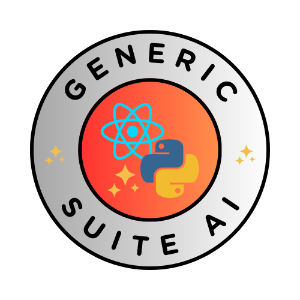

# Welcome to GenericSuite

<table cellpadding="0" cellspacing="0" style="border: 0px white;">
<tr>
    <td></td>
    <td></td>
</tr>
</table>

GenericSuite is a comprehensive software library designed for backend and frontend App development in Python and React.js, including AI features, to enhance your productivity and streamline your workflows.

## Table of Contents

* [What is the GenericSuite for?](#what-is-the-genericsuite-for)
* [The GenericSuite Core](#the-genericsuite-core)
* [The GenericSuite AI](#the-genericsuite-ai)
* [Repositories](#repositories)
* [Post](#posts)
* [Frontend Development](./Frontend-Development/index.md)
* [Backend Development](./Backend-Development/index.md)
* [Configuration Guide](./Configuration-Guide/index.md)
* [History](./history.md)

## What is the GenericSuite for?

The GenericSuite is a frontend and backend set of utilities made with ReactJS and Python to help develop Apps faster.

It's composed by a **GenericSuite Core** is the code base all the suite elements, like extensions and plug-ins.

## The GenericSuite Core

Features:

* Customizable CRUD editor, menu generator, customizable login interface, deploy to AWS and a suite of tools to kickstart your frontend development process.
* Generic CRUD database and API endpoints: by having a core Create-Read-Update-Delete code that can be parametrized & extended, there’s no need to rewrite code for each table editor.
* Generic menu and API endpoints builder.
* Database abstractor: The backend can use DynamoDB or MongoDB as the persistent storage. ImplementS DynamoDB access by a MongoDB-styled syntax.
* Framework abstractor: supports various frameworks including FastAPI, Flask and Chalice, making it adaptable to a range of projects.
* [Utilities](./Backend-Development/GenericSuite-Scripts/index.md), and [Configurations](./Configuration-Guide/index.md) necessary to build and deploy scalable and maintainable applications.

Libraries:

* :fontawesome-brands-react:{ .react } [GenericSuite Core (frontend version) for React.js](./Frontend-Development/GenericSuite-Core/index.md)
* :fontawesome-brands-python:{ .python } [GenericSuite Core (backend version) for Python](./Backend-Development/GenericSuite-Core/index.md)
* :fontawesome-brands-linux:{ .linux } [GenericSuite Scripts (backend version)](./Backend-Development/GenericSuite-Scripts/index.md)

## The GenericSuite AI

The GenericSuite AI is a frontend and backend set of utilities made with ReactJS and Python to help develop Apps that implements AI.

Features:

* **ai_chatbot** endpoint to implement NLP conversations based on OpenAI or Langchain APIs.
* OpenAI, Google Gemini, Anthropic, Ollama, and Hugging Face models handling.
* Clarifai models and embeddings handling.
* Computer vision (OpenAI GPT4 Vision, Google Gemini Vision, Clarifai Vision).
* Speech-to-text processing (OpenAI Whisper, Clarifai Audio Models).
* Text-to-speech (OpenAI TTS-1, Clarifai Audio Models).
* Image generator (OpenAI DALL-E 3, Google Gemini Image, Clarifai Image Models).
* Vector indexers (FAISS, Chroma, Clarifai, Vectara, Weaviate, MongoDBAtlasVectorSearch)
* Embedders (OpenAI, Hugging Face, Clarifai, Bedrock, Cohere, Ollama)
* Web search tool.
* Webpage scrapping and analyzing tool.
* JSON, PDF, Git and YouTube readers.
* Language translation tools.
* Chats stored in the Database.
* User Plan, OpenAI API key and model name attributes in the user profile, to allow free plan users to use Models at their own expenses.

Libraries:

* :fontawesome-brands-react:{ .react } [GenericSuite AI (frontend version) for React.js](./Frontend-Development/GenericSuite-AI/index.md)
* :fontawesome-brands-python:{ .python } [GenericSuite AI (backend version) for Python](./Backend-Development/GenericSuite-AI/index.md)
* :fontawesome-brands-linux:{ .linux } [GenericSuite Scripts (backend version)](./Backend-Development/GenericSuite-Scripts/index.md)

## Repositories

Click [here](./repositories.md) to review the Git repositories, NPMJS and Pypi libraris.

## Posts

* English: [https://www.carlosjramirez.com/genericsuite](https://www.carlosjramirez.com/genericsuite)
* Spanish: [https://www.carlosjramirez.com/genericsuite-es/](https://www.carlosjramirez.com/genericsuite-es/)

## License

GenericSuite is open-sourced software licensed under the [ISC](https://github.com/tomkat-cr/genericsuite-basecamp/blob/main/LICENSE) license.

## Credits

This project is developed and maintained by [Carlos J. Ramirez](https://www.carlosjramirez.com). For more information or to contribute to the project, visit [GenericSuite on GitHub](https://github.com/stars/tomkat-cr/lists/genericsuite).

[https://genericsuite.carlosjramirez.com](https://genericsuite.carlosjramirez.com)

Happy Coding!