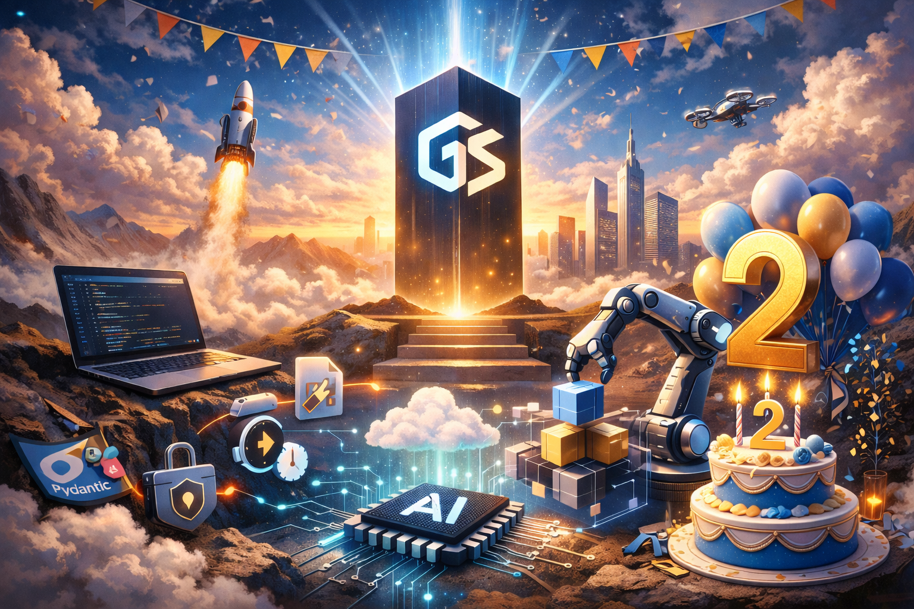

# Unlock Full-Stack Power with Generic Suite (GS)

{ .center }

Have you ever found yourself copying the same common useful code from app to app over and over again?

Don't you ever think that building a full-stack application is too complex?

GenericSuite (GS) is an open source framework for building applications with AI-powered enhancements. Define your application in JSON files. Get web, mobile, backend API and MCP services out - ready to deploy and scale.

It's based on the generic programming paradigm (DRY Principle), and let define the application menu structure, database schemas, data input forms, API endpoints, user authentication and authorization using JSON configuration files.

The result is a complete application ready to be deployed and scaled:

- The web frontend is built with ReactJs
- Mobile apps are built with Flutter (supporting iOS, Android, Windows, macOS and web)
- The backend APIs are built with Python and the framework of your choice (FastAPI, Flask or Chalice)
- MCP Server is built with Python and FastMCP
- Supports major cloud providers for deployment (AWS, GCP, Azure)
- Supports major database engines (MongoDB, DynamoDB, PostgreSQL, MySQL, Supabase)
- AI features can be powered by Claude, OpenAI, Gemini, AWS Bedrock, Google Vertex AI, Hugging Face, Ollama, etc.

Whether you're building robust APIs, scalable databases, or dynamic user interfaces, GS provides the flexibility and efficiency needed to accelerate your projects.

Join the growing community of developers using Generic Suite to supercharge their projects. Explore the repositories and start building today!

[Release Notes](./Releases/index.md) | [Sample Code](./Sample-Code/index.md) | [Repositories](./repositories.md)

## Get Started

* [Key Features](#key-features)
* [Why choose Generic Suite?](#why-choose-generic-suite)
* [What is the Generic Suite for?](#what-is-the-generic-suite-for)
* [The Generic Suite Core](#the-generic-suite-core)
* [The Generic Suite AI](#the-generic-suite-ai)
* [Sample Code](#sample-code)
* [Repositories](#repositories)
* [Releases](#releases)
* [Presentation](#presentation)
* [Post](#posts)
* [Frontend Development](./Frontend-Development/index.md)
* [Backend Development](./Backend-Development/index.md)
* [Mobile Development](./Mobile-Development/index.md)
* [Configuration Guide](./Configuration-Guide/index.md)
* [History](./history.md)

## Key Features

### Core Framework

* Customizable CRUD editor, menu generator, and login interface.
* Generic database and API endpoint builder to eliminate redundant coding.
* Backend framework abstraction supporting FastAPI, Flask, and Chalice.
* Database abstraction for MongoDB, DynamoDB, Postgres, MySQL, and Supabase with a unified query syntax.
* Easy deployment with AWS and other cloud services.

### AI-Powered Development

* MCP Server to open the developed applications to AI Agents.
* AI chatbot endpoint with OpenAI, LangChain, and Hugging Face integrations.
* Computer vision, speech processing, and text-to-speech capabilities.
* Web scraping, translation tools, and vector search for advanced data handling.

### AI Skills

* GenericSuite AI Skills plugin collection: a set of AI agent skills that build a complete GenericSuite application — React frontend, FastAPI backend, JSON-driven CRUD, AI assistant and MCP server — from a conversation.

### Security

* GenericSuite Security Skills plugin collection: a set of AI agent skills and scripts to detect and respond to security threats, vulnerabilities and compliance issues.

### Effortless DevOps & Deployment

* Deployments to production, QA, Staging and demo with OpenTofu (IaC) and CloudFormation (AWS).
* Support for multiple Cloud deployment platforms: AWS, Azure, GCP.
* Pre-configured GitOps scripts for Kubernetes, Docker, and VPS environments.
* Local AI service setups, including OLLAMA, WebUI, Stable Diffusion, and N8N.
* Comprehensive documentation and best practices via Generic Suite Basecamp.

### GSAM (Generic Suite App Maker)

* AI-assisted ideation for app development, code generation, and database structuring.
* Image and video generation using cutting-edge AI models.
* AI-powered app presentations, naming suggestions, and prompt engineering.

## Why Choose Generic Suite?

* Seamless Full-Stack Integration – Develop applications faster with a unified library for both frontend and backend, reducing redundant code and ensuring consistency.
* AI-Driven Efficiency – Leverage built-in AI capabilities to enhance automation, generate content, and optimize software development.
* Customizable & Scalable – Adapt the framework to your specific needs, with support for multiple programming frameworks, databases, and deployment platforms.
* Accelerated Development Workflow – Pre-built utilities and automation tools save time, letting you focus on innovation instead of repetitive tasks.
* Cross-Platform Compatibility – Whether you're working with FastAPI, Flask, Chalice, MongoDB, DynamoDB, Postgres, MySQL, Supabase, GS adapts to your tech stack effortlessly.

## What is the Generic Suite for?

GenericSuite is a development library designed to streamline frontend, backend, mobile and AI workflows, enabling rapid app development with AI-powered enhancements. It has a set of utilities made with ReactJS, Flutter, and Python.

It's composed by a [Generic Suite Core](#the-generic-suite-core), which is the core for all the suite elements, extensions like the [Generic Suite AI](#the-generic-suite-ai), [Generic Suite Mobile](#the-generic-suite-mobile), and auxiliary tools like the [Generic Suite Gitops](#server-operations), [Generic Suite AI Agent Skills](#genericsuite-ai-agent-skills), and [Generic Suite App Maker](#gsam-the-generic-suite-ai-app-maker).

{ .center }

## The Generic Suite Core

Features:

* Customizable CRUD editor, menu generator, customizable login interface, deploy to AWS and a suite of tools to kickstart your frontend development process.
* Generic CRUD database and API endpoints: by having a core Create-Read-Update-Delete code that can be parametrized & extended, there’s no need to rewrite code for each table editor.
* Generic menu and API endpoints builder.
* Database abstractor: The backend can use MongoDB, DynamoDB, Postgres, MySQL, or Supabase as the persistent storage, implementing as MongoDB-styled syntax.
* Framework abstractor: supports various frameworks including FastAPI, Flask and Chalice, making it adaptable to a range of projects.
* [Utilities](./Backend-Development/GenericSuite-Scripts/index.md), and [Configurations](./Configuration-Guide/index.md) necessary to build and deploy scalable and maintainable applications.

Documentation and repositories:

* :fontawesome-brands-react:{ .react } [GenericSuite Core (frontend version) for React.js](./Frontend-Development/GenericSuite-Core/index.md)
* :fontawesome-brands-python:{ .python } [GenericSuite Core (backend version) for Python](./Backend-Development/GenericSuite-Core/index.md)
* :fontawesome-brands-linux:{ .linux } [GenericSuite Scripts (frontend version)](./Frontend-Development/GenericSuite-Scripts/index.md)
* :fontawesome-brands-linux:{ .linux } [GenericSuite Scripts (backend version)](./Backend-Development/GenericSuite-Scripts/index.md)
* Repositories: [Superproject](./repositories.md#superproject), [Frontend](./repositories.md#frontend), [Backend](./repositories.md#backend)
* Packages: [PyPI and NPMJS](./repositories.md#published-packages)

{ .center }

## The Generic Suite AI

The **Generic Suite AI** is an extension to help develop Apps that implements AI.

Features:

* AI Agent endpoint to implement NLP Chatbot-like conversations.
* OpenAI GPT, Google Gemini, Anthropic Claude, Meta Llama, Hugging Face, xAI, IBM WatsonX, and many other models handling.
* OpenAI API, Google API, Anthropic API, Hugging Face, Together AI, OpenRuter, AI/ML API, Ollama, Clarifai and other LLM providers.
* Computer vision (OpenAI GPT4 Vision, Google Gemini Vision, Clarifai Vision).
* Speech-to-text processing (OpenAI Whisper, Clarifai Audio Models).
* Text-to-speech (OpenAI TTS-1, Clarifai Audio Models).
* Image generator (OpenAI DALL-E 3, Google Gemini Image, Clarifai Image Models).
* Vector indexers (FAISS, Chroma, Clarifai, Vectara, Weaviate, MongoDBAtlasVectorSearch).
* Embeddings (OpenAI, Hugging Face, Bedrock, Cohere, Ollama, Clarifai).
* Web search tool.
* Webpage scrapping and analyzing tool.
* JSON, PDF, Git and YouTube readers.
* Language translation tools.
* Chats stored in the Database.
* User Plan, OpenAI API key and model name attributes in the user profile, to allow free plan users to use Models at their own expense.

Documentation and repositories:

* :fontawesome-brands-react:{ .react } [GenericSuite AI (frontend version) for React.js](./Frontend-Development/GenericSuite-AI/index.md)
* :fontawesome-brands-python:{ .python } [GenericSuite AI (backend version) for Python](./Backend-Development/GenericSuite-AI/index.md)
* :fontawesome-brands-linux:{ .linux } [GenericSuite Scripts (backend version)](./Backend-Development/GenericSuite-Scripts/index.md)
* Repositories: [Frontend](./repositories.md#frontend), [Backend](./repositories.md#backend)
* Packages: [PyPI and NPMJS](./repositories.md#published-packages)

### Generic Suite Mobile

Features:

* Same as [the Generic Suite Core](#the-generic-suite-core) but for mobile app builder.
* Made with Flutter for iOS, Android, Windows, macOS and web.

Documentation and repositories:

* :fontawesome-brands-flutter:{ .flutter } [GenericSuite Mobile for Flutter](./Mobile-Development/index.md)
* Repositories: [Mobile](./repositories.md#mobile)

### GenericSuite AI Agent Skills

The **GenericSuite AI Agent Skills** is a Claude Skills plugin collection for the GenericSuite ecosystem. Its centerpiece is the **app-builder suite** (`gs-app-builder-suite`): a set of AI agent skills that build a complete GenericSuite application — React frontend, FastAPI backend, JSON-driven CRUD, AI assistant and MCP server — from a conversation.

Documentation and repositories:

* :fontawesome-brands-openai:{ .openai } [GenericSuite AI Agent Skills](./ai-skills.md)
* [Repositories](./repositories.md#ai)

### GSAM: The Generic Suite AI App Maker

The **Generic Suite App Maker (GSAM)** is the AI tool to enhance the software development ideation and test AI models, LLM providers and its features. It also allows to generate descriptions, database structures, images, videos or answers from a text prompt, and kick start code to be used with the Generic Suite library.

Repository:

* :fontawesome-brands-python:{ .python } [GenericSuite App Maker](https://github.com/tomkat-cr/genericsuite-app-maker)

<!--
### AI Agentic Software Development Team

The **Generic Suite Agentic Software Development Team (ASDT)** provides a team of autonomous entities designed to solve software development problems using AI to make decisions, learn from interactions, and adapt to changing conditions without human intervention.

Repository:

* :fontawesome-brands-python:{ .python } [GenericSuite Agentic Software Development Team](https://github.com/tomkat-cr/genericsuite-asdt-be)
-->

## Security

**`Genericsuite Security Suite`** is a security auditing and production-readiness suite for software repositories and developer environments. It provides **5 specialized AI agent skills** backed by zero-dependency Python 3 standard library scripts.

Whether used interactively through AI coding assistants (**Claude Code**, **Google Antigravity**, **Cursor**, **Windsurf**, etc.) or directly as standalone CLI tools in CI/CD pipelines, this package helps developers audit supply chain dependencies, pin container references, eliminate unpinned GitHub Actions, and verify project readiness before production deployment.

Documentation and repositories:

* :fontawesome-brands-openai:{ .openai } [GenericSuite Security Skills](./security.md)
* [Repositories](./repositories.md#security)

## Server Operations

The **Generic Suite Gitops** provides the scripts and configurations needed to deploy on various platforms (local development servers, VPS) using orchestration technologies like Kubernetes, and manage artifacts and repositories with Docker and GitHub.

Documentation and repositories:

* Deployment Guide: [OpenTofu (IaC) Deployment Guide](./Deployment-Guide/opentofu.md)
* [Repositories](./repositories.md#platform)

## Repositories

[Click here](./repositories.md) to review the Git repositories, NPMJS and PyPI packages.

## Documentation

* Main: [https://genericsuite.carlosjramirez.com](https://genericsuite.carlosjramirez.com)
* Mirror: [https://genericsuite.readthedocs.io](https://genericsuite.readthedocs.io)
* Mobile App (join the test flight to try it out): [Google Play Store](https://play.google.com/apps/internaltest/4701425955610073424)

## Sample Code

We have an [ExampleApp](../code/exampleapp/README.md) to show you how to use the GenericSuite libraries.

    

[ExampleApp](../code/exampleapp/README.md) is a full-featured example application built as a monorepo using Turborepo and pnpm. This provides a practical, real-world blueprint for developers to learn from and accelerate their own projects. There are a frontend in React and backends in Python, using the 3 main frameworks: FastAPI, Flask and Chalice.

    

Also we have a [FastAPI Template](../code/fastapitemplate/README.md) to help you get started with FastAPI based backends.

Check the [Sample Code](./Sample-Code/index.md) section for more information.

## Releases

You can find the detailed changelog for each release [here](./Releases/index.md).

We are proud to announce the [GenericSuite 20260218 Release - The 2nd Anniversary Edition](./Releases/GS_Release_2026-02-18_Changelog.md)

## Presentation

English:

* [Introduction to Generic Suite](https://raw.githubusercontent.com/tomkat-cr/genericsuite-basecamp/main/mkdocs_root/en/documents/GS_Presentation_EN_V2.pdf)

Spanish:

* [Introducción a Generic Suite](https://raw.githubusercontent.com/tomkat-cr/genericsuite-basecamp/main/mkdocs_root/es/documents/GS_Presentation_SP_V2.pdf)

## Posts

X: [@genericsuitelib](https://twitter.com/genericsuitelib)

English:

* [https://www.carlosjramirez.com/en/genericsuite/](https://www.carlosjramirez.com/en/genericsuite/)

Spanish:

* [https://www.carlosjramirez.com/genericsuite-es/](https://www.carlosjramirez.com/genericsuite-es/)

## License

Generic Suite is open-sourced software licensed under the [MIT](https://github.com/tomkat-cr/genericsuite-basecamp/blob/main/LICENSE) license.

## Credits

This project is developed and maintained by [Carlos Ramirez](https://www.carlosjramirez.com). For more information or to contribute to the project, visit [GenericSuite on GitHub](https://github.com/stars/tomkat-cr/lists/genericsuite).

## Privacy Policy

[Click here](./privacy-policy.md) to review the privacy policy.

Happy Coding!