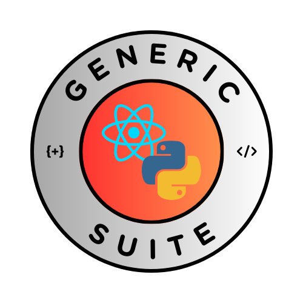

# GenericSuite para ReactJS



The GenericSuite (frontend version) has a customizable CRUD editor, menu generator, login interface, API secure communication and a suite of tools to kickstart your development process.

## Características

- **Editor CRUD personalizable:** código CRUD central (Create-Read-Update-Delete) que puede parametrizarse y extenderse mediante archivos de configuración JSON. No es necesario reescribir el código para cada editor de tablas.
- **Menú personalizable:** el menú y los endpoints pueden parametrizarse y ampliarse mediante archivos de configuración JSON en el lado del backend. La API proporcionará la estructura del menú y la verificación de seguridad basada en el grupo de seguridad del usuario, y GenericSuite mostrará el menú y las opciones disponibles.
- **Interfaz de inicio de sesión personalizable:** Adapte fácilmente la página de inicio de sesión para que coincida con la identidad de su marca con el logotipo de la aplicación.
- **Scripts de desarrollo y producción:** Comandos rápidos para iniciar el desarrollo o construir su aplicación para entornos de QA, staging y producción en AWS.
- **Pruebas con Jest:** Viene preconfigurado con Jest para ejecutar pruebas, incluida una prueba inicial para el componente `<App />`.

El compañero perfecto para esta solución de frontend es la [versión de backend de The GenericSuite](https://github.com/tomkat-cr/genericsuite-be).

There's a version of this library with AI features: [The GenericSuite AI](https://github.com/tomkat-cr/genericsuite-fe-ai).

## Requisitos previos

Debe instalar estas herramientas:

- Versión de Node.js 26+, instalada vía [NVM (Node Package Manager)](https://nodejs.org/en/download/package-manager) o [NPM y Node](https://nodejs.org/en/download) instalación.
- [Git](https://www.atlassian.com/git/tutorials/install-git)
- Make: [Mac](https://formulae.brew.sh/formula/make) | [Windows](https://stackoverflow.com/questions/32127524/how-to-install-and-use-make-in-windows)

## Inicio

Para empezar con GenericSuite, siga estos pasos:

### Crear los repositorios de Git

Cree los repositorios en su plataforma Git favorita ([Github](https://github.com/), [Gitlab](https://gitlab.com/), [Bitbucket](https://bitbucket.org/)).

Un repositorio es para la aplicación frontend y el otro para las configuraciones (archivos de configuración JSON) que se compartirán entre los repositorios de frontend y backend como un submódulo de Git.

Una vez creados, abra una ventana de Terminal y cambie al directorio raíz de sus repos.

Clonar los repos.

Ej.: para un repositorio llamado `exampleapp_frontend` creado en Github:

```bash
git clone https://github.com/tomkat-cr/exampleapp_frontend.git
```

Y para el repositorio de configuraciones llamado `exampleapp_configs` creado en Github:

```bash
git clone https://github.com/tomkat-cr/exampleapp_configs.git
```

### Build tools

Genericsuite admite las siguientes herramientas de compilación:

- **Vite**<br>
  Vite es una herramienta de construcción que tiene como objetivo proporcionar una experiencia de desarrollo más rápida y ligera para proyectos web modernos. Para más información consulte la [documentación de Vite](https://vite.dev).<br><br>

- **Webpack**<br>
  En su núcleo, Webpack es un empaquetador estático de módulos para aplicaciones modernas de JavaScript. Para más información consulte la [documentación de Webpack](https://webpack.js.org).<br><br>

- **Create React App**<br>
  Create React App (CRA) es una herramienta que le permite crear aplicaciones React. Su desarrollo y mantenimiento han quedado abandonados, por lo que recomendamos usar "Vite" o "Webpack". Para más información consulte la [documentación de Create React App](https://create-react-app.dev).<br><br>

- **React-app-rewired**<br>
  React-app-rewired es una alternativa al Create React App predeterminado. Recomendamos usar "Vite" o "Webpack" porque hoy en día está mantenido de forma más ligera por la comunidad. Para más información consulte la [documentación de react-app-rewired](https://github.com/timarney/react-app-rewired).<br><br>

### Iniciar tu proyecto

Cree la App ReactJS. Por ejemplo, `exampleapp_frontend`:

* **Vite**<br>

```bash
npm create vite@latest exampleapp_frontend -- --template react
```

Automáticamente realiza el `npm init` y `git init`, añade las dependencias de ReactJS y crea una estructura de proyecto ReactJS por defecto.

* **Webpack**<br>

```bash
npm create webpack@latest exampleapp_frontend -- --template react
```

Automáticamente realiza el `npm init` y `git init`, añade las dependencias de ReactJS y crea una estructura de proyecto ReactJS por defecto.

* **Create React App**<br>

```bash
npx create-react-app exampleapp_frontend
```

NOTA: Consulte la documentación [aquí](https://react.dev/learn/start-a-new-react-project) para alternativas de CRA (`create-react-app`).

* **React-app-rewired**<br>

Cambie a su directorio de desarrollo local del frontend.<br>
```bash
cd exampleapp_frontend
```

CRA (`create-react-app`) está desactualizado, por lo que usamos [react-app-rewired](https://www.npmjs.com/package/react-app-rewired) para personalizar la configuración de CRA sin necesidad de expulsar:

```bash
npm install --save-dev react-app-rewired
```

### Instalar el paquete GenericSuite

```bash
npm install genericsuite
```

### Instalar dependencias de desarrollo adicionales

```bash
npm install --save-dev \
   @babel/core \
   @babel/plugin-transform-class-properties \
   @babel/plugin-proposal-private-property-in-object \
   @babel/plugin-syntax-jsx \
   @babel/preset-env \
   @babel/preset-react \
   @babel/preset-typescript \
   @testing-library/jest-dom \
   @testing-library/react \
   @types/jest \
   @types/react \
   babel-jest \
   babel-loader \
   babel-plugin-css-modules-transform \
   jest \
   jest-environment-jsdom \
   postcss \
   react-test-renderer \
   tailwindcss \
   whatwg-fetch
```

### Desinstalar dependencias no requeridas

Desinstalar dependencias no requeridas instaladas por CRA e incluidas en la biblioteca GenericSuite:

```bash
npm uninstall react react-dom react-scripts web-vitals
```

### Instalar solo las herramientas de compilación

Si ya tiene su proyecto inicializado, p. ej. con CRA, puede instalar por separado las herramientas de compilación alternativas:

* **Vite**<br>

```bash
npm install --save-dev vite @vitejs/plugin-react 
```
<!--
npm install --save-peer --strict-peer-deps vite @vitejs/plugin-react 
-->

* **Webpack**<br>

```bash
npm install --save-dev \
   webpack \
   webpack-cli \
   webpack-dev-server \
   html-webpack-plugin \
   interpolate-html-plugin \
   css-loader \
   postcss-loader \
   style-loader
```
<!--
npm install --save-peer --strict-peer-deps webpack webpack-cli webpack-dev-server html-webpack-plugin interpolate-html-plugin css-loader postcss-loader style-loader
-->

### Preparar los archivos de configuración

Copie la plantilla del archivo [.env.example](https://github.com/tomkat-cr/genericsuite-fe/blob/main/.env.example) desde `node_modules/genericsuite` a su archivo `.env`:

```bash
cp node_modules/genericsuite/.env.example .env`
```

Y configure las variables según sus necesidades:

- Asigne `REACT_APP_APP_NAME` con el nombre de su App.

- Asigne `API_VERSION` con la versión de la API. Por defecto es "v1".

- Asigne `APP_LOCAL_DOMAIN_NAME` con el dominio de la API del entorno de desarrollo local. Por ejemplo app.exampleapp.local o localhost.<br>
Predeterminado a app.${REACT_APP_APP_NAME}.local (REACT_APP_APP_NAME se convertirá a todo en minúsculas).

- Asigne `FRONTEND_LOCAL_PORT` con el número de puerto del frontend de desarrollo local. Por defecto es 3000.

- Asigne `BACKEND_LOCAL_PORT` con el número de puerto de la API backend de desarrollo local. Por defecto es 5001.

- Asigne `APP_API_URL_QA`, `APP_API_URL_STAGING`, `APP_API_URL_PROD`, y `APP_API_URL_DEMO` con los correspondientes nombres de dominio público de la API backend para tus entornos de la App.

- Asigne `APP_FE_URL_QA`, `APP_FE_URL_STAGING`, `APP_FE_URL_PROD`, y `APP_FE_URL_DEMO` con los correspondientes nombres de dominio público del frontend para tus entornos de la App.

- Asigne `REACT_APP_URI_PREFIX` con el prefijo de la URI de la App. Esto se usará en todos los entornos después del nombre de dominio. Por ejemplo: https://app.exampleapp.com/exampleapp_frontend

- Configure su `RUN_BUNDLER` deseado. Las opciones disponibles son "vite", "webpack" y "react-scripts". Por defecto es "vite".

- Configure `RUN_PROTOCOL` con el protocolo para su entorno de desarrollo local. Las opciones disponibles son "http" y "https". Por defecto es "" lo que significa que el usuario debe configurar manualmente el protocolo cuando inicie el entorno de desarrollo local.

- Configure `BACKEND_PATH` con la ruta de su repositorio local de desarrollo de la API backend.

- Configure `GIT_SUBMODULE_LOCAL_PATH_FRONTEND` y `GIT_SUBMODULE_URL` con los parámetros de submódulo JSON para establecer un lugar común de configuración tanto para frontend como para backend (utilizado por add_github_submodules.sh).<br>Para archivos de ejemplo, visite: [Guía de Configuración de Generic Suite](./../../Configuration-Guide/index.md)

- Configure los parámetros `AWS_*` con sus datos de AWS (utilizado por aws_deploy_to_s3.sh y change_env_be_endpoint.sh). Necesitará una cuenta de AWS.

Para obtener más información, consulte los comentarios de cada variable en el archivo [.env.example](https://github.com/tomkat-cr/genericsuite-fe/blob/main/.env.example).

#### Otros parámetros

- `REACT_APP_X_TOKEN=1` para usar 'x-access-tokens' en lugar de 'Authorization: Bearer'. Por defecto es "0"


### Preparar el Makefile

Copie la plantilla de Makefile desde `node_modules/genericsuite-fe-scripts`:

```bash
cp node_modules/genericsuite-fe-scripts/Makefile ./Makefile
```

### Cambiar Scripts en Package.json

Abra el `package.json`:

```bash
vi ./package.json
# o
# code ./package.json
```

Si desea alojar su frontend en **github.io**, agregue el parámetro homepage:

```package.json
"homepage": "https://your-github-username.github.io/your-github-repository/",
```

NOTE: replace `your-github-username` and `your-github-repository` with your owns.

Agregue los siguientes scripts:

```package.json
   "scripts": {
      "start": "node server.js",
      "start-build": "./node_modules/react-app-rewired/bin/react-app-rewired.js build && node server.js",
      "start-debug": "ls -lah && node server.js",
      "start-dev": "react-app-rewired start",
      "start-dev-webpack": "npx webpack-dev-server --config webpack.config.js",
      "build-prod": "webpack --mode production",
      "build-dev": "react-app-rewired build",
      "build": "react-app-rewired build",
      "eject-dev": "react-scripts eject",
      "test-dev": "react-app-rewired test",
      "test": "jest",
      "predeploy": "npm run build",
      "deploy": "# gh-pages -d build # Uncomment this line to deploy to github pages and run 'npm install -D gh-pages'",
      "check-types": "tsc --noEmit"
   },
```

## Estructura de la App

Esta es una estructura sugerida de desarrollo de la App:

```
.
├── .babelrc
├── .env
├── .env.example
├── .gitignore
├── CHANGELOG.md
├── index.html
├── LICENSE
├── Makefile
├── README.md
├── babel.config.js
├── config-overrides.js
├── jest.config.cjs
├── package-lock.json
├── package.json
├── public
├── server.js
├── src
│   ├── components
│   │   ├── About
│   │   │   └── About.jsx
│   │   ├── App
│   │   │   ├── App.jsx
│   │   │   └── App.test.tsx
│   │   ├── HomePage
│   │   │   ├── HomePage.jsx
│   │   ├── ExampleMenu
│   │   │   ├── ExampleMainElement.jsx
│   │   │   └── ExampleChildElement.jsx
│   ├── constants
│   │   └── app_constants.jsx
│   ├── images
│   │   ├── app_logo_circle.svg
│   │   └── madeby_logo_square.svg
│   ├── configs
│   │   ├── CHANGELOG.md
│   │   ├── README.md
│   │   ├── backend
│   │   │   ├── app_main_menu.json
│   │   │   ├── endpoints.json
│   │   │   ├── general_config.json
│   │   │   ├── example_main_element.json
│   │   │   └── example_child_element.json
│   │   └── frontend
│   │       ├── app_constants.json
│   │       ├── general_constants.json
│   │       ├── users_profile.json
│   │       ├── example_main_element.json
│   │       └── example_child_element.json
│   ├── d.ts
│   ├── index.jsx
│   ├── input.css
│   └── setupTests.js
├── tailwind.config.js
├── tsconfig.json
├── version.txt
├── vite.config.mjs
└── webpack.config.js
```

## Configurar el proyecto

En el directorio del proyecto:

- `.babelrc` ([ejemplo](https://github.com/tomkat-cr/genericsuite-fe/blob/main/.babelrc))<br><br>

- `babel.config.js` ([ejemplo](https://github.com/tomkat-cr/genericsuite-fe/blob/main/babel.config.cjs))<br>
Configuración del transpiler Babel. Consulta la [documentación aquí](https://babeljs.io/docs/configuration).<br><br>

- `CHANGELOG` ([ejemplo](https://github.com/tomkat-cr/genericsuite-fe/blob/main/CHANGELOG.md))<br>
Cambios documentados para este proyecto.<br><br>

- `config-overrides.js` ([ejemplo](https://github.com/tomkat-cr/genericsuite-fe/blob/main/config-overrides.js))<br>
Configuración de React-app-rewired. Para más información consulta la [documentación de react-app-rewired](https://github.com/timarney/react-app-rewired).<br><br>

- `jest.config.cjs` ([ejemplo](https://github.com/tomkat-cr/genericsuite-fe/blob/main/jest.config.cjs))<br>
Configuración de pruebas JEST.<br><br>

- `server.js` ([ejemplo](https://github.com/tomkat-cr/genericsuite-fe/blob/main/server.js))<br>
Servidor Node.js, para probar y depurar tu App en un entorno similar a producción.<br><br>

- `tailwind.config.js`<br>
Instalar e inicializar Tailwind con las [instrucciones aquí](https://tailwindcss.com/docs/installation).<br>
Para configuración adicional de Tailwind, consulta la [documentación aquí](https://tailwindcss.com/docs/configuration).<br><br>

Configuración sugerida de Tailwind:

```js
const { relative } = require('path');

/** @type {import('tailwindcss').Config} */
module.exports = {
  darkMode: 'selector',
  content: {
    relative: true,
    files: [
      "./node_modules/genericsuite/src/lib/**/*.{html,js,jsx}",
      "./src/lib/components/**/*.{html,js,jsx}",
      "./src/lib/constants/**/*.{html,js,jsx}",
                .
                .
      "./src/index.{tsx,jsx,cjs}",
      './public/index.html',
    ],
  },
  theme: {
    extend: {},
  },
  plugins: [
  ],
}
```

- `vite.config.mjs` ([ejemplo](https://github.com/tomkat-cr/genericsuite-fe/blob/main/vite.config.mjs))<br>
Configuración de Vite. Para más información consulte la [documentación de Vite](https://vite.dev/guide).<br><br>

**IMPORTANTE**: si tiene un archivo `vite.config.js`, renómelo a `vite.config.mjs`. Si no lo haces, Vite no funcionará y mostrará errores como:
```
ERROR: [plugin: externalize-deps] Failed to resolve "@tailwindcss/vite". This package is ESM only but it was tried to load by `require`.
```

- `webpack.config.js` ([ejemplo](https://github.com/tomkat-cr/genericsuite-fe/blob/main/webpack.config.js))<br>
Para configurar Webpack como alternativa a CRA / `react-app-rewired`.<br>
**IMPORTANTE**: Asegúrate de reemplazar `entry: './src/index.tsx'` por `entry: './src/index.jsx'`.<br>
Consulta la [documentación aquí](https://webpack.js.org/configuration).<br>
<br>

- `tsconfig.json`<br>

Para configurar TypeScript. p. ej.

```json
{
  "compilerOptions": {
    "outDir": "./dist",
    "module": "ESNext",
    "moduleResolution": "node",
    "target": "es5",
    "lib": [
      "es6",
      "dom"
    ],
    "sourceMap": true,
    "allowJs": true,
    "checkJs": false,
    "jsx": "react",
    "baseUrl": "./src",
    "rootDirs": [
      "src"
    ],
    "resolveJsonModule": true,
    "esModuleInterop": true,
    "forceConsistentCasingInFileNames": true,
    "allowSyntheticDefaultImports": true,
    "strict": true,
    "skipLibCheck": true,
    "declaration": true,
    "declarationDir": "types",
    "emitDeclarationOnly": true,
    "paths": {
      "src/*": ["./src/*"],
    }
  },
  "include": [
    "src/**/*",
  ]
}
```

## Personalizar index.html

### Opción 1

Si no tiene un `public/index.html` personalizado (solo el predeterminado creado por CRA):

Cree el archivo `public/index.html`:

```bash
vi public/index.html
```

Copie y pegue este contenido:

```html
<!DOCTYPE html>
<html lang="en">
  <head>
    <meta charset="utf-8" />
    <link rel="icon" href="%PUBLIC_URL%/favicon.ico" />
    <meta name="viewport" content="width=device-width, initial-scale=1.0" />
    <meta name="theme-color" content="#000000" />
    <meta
      name="description"
      content="Web site created using create-react-app"
    />
    <link rel="apple-touch-icon" href="%PUBLIC_URL%/logo192.png" />
    <!-- Tailwind -->
    <link href="%PUBLIC_URL%/output.css" rel="stylesheet">
    <!--
      manifest.json provides metadata used when your web app is installed on a
      user's mobile device or desktop. See https://developers.google.com/web/fundamentals/web-app-manifest/
    -->
    <link rel="manifest" href="%PUBLIC_URL%/manifest.json" />
    <!--
      Notice the use of %PUBLIC_URL% in the tags above.
      It will be replaced with the URL of the `public` folder during the build.
      Only files inside the `public` folder can be referenced from the HTML.

      Unlike "/favicon.ico" or "favicon.ico", "%PUBLIC_URL%/favicon.ico" will
      work correctly both with client-side routing and a non-root public URL.
      Learn how to configure a non-root public URL by running `npm run build`.
    -->
    <title>exampleapp.com</title>
    <style>
        a { cursor: pointer; }
    </style>
    <base href="/">
  </head>
  <body>
    <noscript>You need to enable JavaScript to run this app.</noscript>
    <div id="root"></div>
    <!--
      This HTML file is a template.
      If you open it directly in the browser, you will see an empty page.

      You can add webfonts, meta tags, or analytics to this file.
      The build step will place the bundled scripts into the <body> tag.

      To begin the development, run `npm start` or `yarn start`.
      To create a production bundle, use `npm run build` or `yarn build`.
    -->
  </body>
</html>
```

### Opción 2

Si ya tiene un archivo `public/index.html` personalizado:

Edite el archivo `public/index.html`:

```bash
vi public/index.html
```

Asegúrese de añadir `%PUBLIC_URL%` a estas líneas:

```html
    <link rel="icon" href="%PUBLIC_URL%/favicon.ico" />
```
```html
    <link rel="apple-touch-icon" href="%PUBLIC_URL%/logo192.png" />
```
```html
    <link rel="manifest" href="%PUBLIC_URL%/manifest.json" />
```

Después de esta línea:

```html
    <link rel="apple-touch-icon" href="%PUBLIC_URL%/logo192.png" />
```

... añade esta línea:

```html
    <link href="%PUBLIC_URL%/output.css" rel="stylesheet">
```

Elimine el pie de página y créditos:

```html
    <!-- credits -->
    <div class="text-center">
      <p>
          <a href="https://exampleapp.com" target="_blank" rel="noreferrer">exampleapp.com</a>
      </p>
    </div>
```

### Paso final para cualquier opción

Finalmente ejecute este comando para crear el archivo `src/output.css`:

```bash
npx @tailwindcss/cli -i ./src/input.css -o ./public/output.css
```

Y copie el archivo generado al directorio `public`:

```bash
cp src/output.css public/
```

Para mantener actualizado el archivo `src/output.css`, durante el ciclo de desarrollo abra una nueva terminal y ejecute:

```bash
make tailwind
```

## Ejemplos de código y archivos de configuración JSON

El menú principal, los endpoints de la API y las configuraciones del editor CRUD se definen en los archivos de configuración JSON.

Puede encontrar ejemplos sobre configuraciones y cómo codificar una App en la [Guía de Creación y Configuración de GenericSuite](../../Configuration-Guide/index.md).

## Uso

## Realizar la primera compilación

```bash
make build
```

### Iniciar el servidor de desarrollo

Para iniciar el servidor de desarrollo:

```bash
make run
```

### Despliegue QA

Consulte la [Guía de Despliegue](../deployment.md) para obtener más detalles.