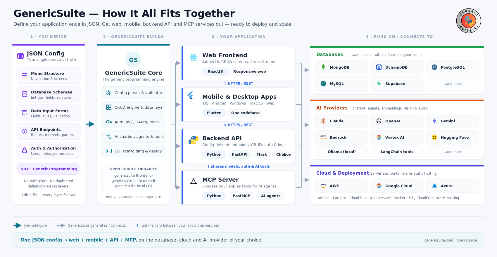
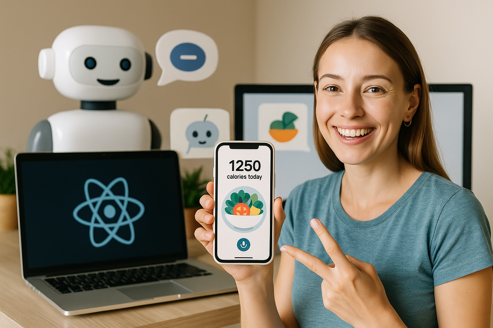

# Desbloquea el poder full-stack con Generic Suite (GS)

GenericSuite (GS) es una biblioteca de desarrollo diseñada para agilizar flujos de trabajo de frontend, backend, móvil e IA, permitiendo un desarrollo rápido de aplicaciones con mejoras impulsadas por IA.

Se basa en el paradigma de programación genérica (principio DRY), y permite definir la estructura del menú de la aplicación, esquemas de bases de datos, formularios de entrada de datos, endpoints de API, autenticación y autorización mediante archivos de configuración JSON.

El resultado es una aplicación completa lista para desplegar y escalar:

- El frontend web está construido con ReactJs
- Las aplicaciones móviles se desarrollan con Flutter (soportando iOS, Android, Windows, macOS y web)
- Las APIs del backend están construidas con Python y el framework de tu elección (FastAPI, Flask o Chalice)
- El MCP Server está construido con Python y FastMCP
- Soporta los principales proveedores de nube para despliegue (AWS, GCP, Azure)
- Soporta los principales motores de base de datos (MongoDB, DynamoDB, PostgreSQL, MySQL, Supabase)
- Las características de IA pueden estar potenciadas por Claude, OpenAI, Gemini, AWS Bedrock, Google Vertex AI, Hugging Face, Ollama, etc.

Ya sea que estés construyendo APIs robustas, bases de datos escalables o interfaces de usuario dinámicas, GS ofrece la flexibilidad y la eficiencia necesarias para acelerar tus proyectos.

[Notas de la versión](./Releases/index.md) | [Código de ejemplo](./Sample-Code/index.md) | [Repositorios](./repositories.md)

## Get Started

Únete a la creciente comunidad de desarrolladores que utilizan Generic Suite para potenciar sus proyectos. ¡Explora los repositorios y empieza a construir hoy mismo!

* [Características clave](#key-features)
* [¿Por qué elegir Generic Suite?](#por-qué-elegir-generic-suite)
* [¿Para qué sirve Generic Suite?](#para-qué-sirve-generic-suite)
* [El Núcleo de Generic Suite](#el-núcleo-de-generic-suite)
* [La IA de Generic Suite](#la-ia-de-generic-suite)
* [Código de ejemplo](#código-de-ejemplo)
* [Repositorios](#repositorios)
* [Versiones](#versiones)
* [Presentación](#presentación)
* [Publicaciones](#publicaciones)
* [Desarrollo Frontend](./Frontend-Development/index.md)
* [Desarrollo Backend](./Backend-Development/index.md)
* [Guía de Configuración](./Configuration-Guide/index.md)
* [Historial](./history.md)

## Key Features

### Core Framework

* Editor CRUD personalizable, generador de menús y interfaz de inicio de sesión.
* Constructor genérico de bases de datos y endpoints de API para eliminar código redundante.
* Abstracción del framework de backend que admite FastAPI, Flask y Chalice.
* Abstracción de bases de datos para MongoDB, DynamoDB, PostgreSQL, MySQL y Supabase con una sintaxis de consultas unificada.
* Despliegue fácil con AWS y otros servicios en la nube.

### AI-Powered Development

* Servidor MCP para abrir las aplicaciones desarrolladas a agentes de IA.
* Endpoint de chatbot de IA con integraciones de OpenAI, LangChain y Hugging Face.
* Visión por computadora, procesamiento del habla y conversión de texto a voz.
* Web scraping, herramientas de traducción y búsqueda vectorial para un manejo avanzado de datos.

### AI Skills

* Colección de plugins Claude Skills: un conjunto de habilidades de agentes de IA que construyen una aplicación completa de GenericSuite — frontend en React, backend en FastAPI, CRUD impulsado por JSON, asistente de IA y servidor MCP — a partir de una conversación.

### Effortless DevOps & Deployment

* Despliegues a producción, QA, Staging y demo con OpenTofu (IaC) y CloudFormation (AWS).
* Soporte para múltiples plataformas de despliegue en la nube: AWS, Azure, GCP.
* Scripts de GitOps preconfigurados para Kubernetes, Docker y entornos VPS.
* Configuraciones de servicios de IA locales, que incluyen OLLAMA, WebUI, Stable Diffusion y N8N.
* Documentación completa y buenas prácticas a través de Generic Suite Basecamp.

### GSAM (Generic Suite App Maker)

* Ideación asistida por IA para el desarrollo de aplicaciones, generación de código y estructuración de bases de datos.
* Generación de imágenes y videos mediante modelos de IA de vanguardia.
* Presentaciones de apps impulsadas por IA, sugerencias de nombres y ingeniería de prompts.

## ¿Por qué elegir Generic Suite?

* Integración full-stack sin fisuras – Desarrolla aplicaciones más rápido con una biblioteca unificada para frontend y backend, reduciendo código redundante y asegurando consistencia.
* Eficiencia impulsada por IA – Aprovecha las capacidades de IA integradas para mejorar la automatización, generar contenido y optimizar el desarrollo de software.
* Personalizable y escalable – Adapta el marco a tus necesidades específicas, con soporte para múltiples frameworks de programación, bases de datos y plataformas de despliegue.
* Flujo de desarrollo acelerado – Utilidades preconstruidas y herramientas de automatización ahorran tiempo, permitiéndote centrarte en la innovación en lugar de tareas repetitivas.
* Compatibilidad multiplataforma – Ya sea que estés trabajando con FastAPI, Flask, Chalice, MongoDB, DynamoDB, PostgreSQL, MySQL, Supabase, GS se adapta a tu pila tecnológica sin esfuerzo.

## ¿Para qué sirve Generic Suite?

Generic Suite es un conjunto de utilidades de frontend y backend hechas con ReactJS y Python para ayudar a desarrollar aplicaciones más rápido.

Está compuesto por un **Núcleo de Generic Suite**, que es el núcleo para todos los elementos de la suite, y extensiones como la Generic Suite AI.

## La IA de Generic Suite

La **IA de Generic Suite** es una extensión para ayudar a desarrollar aplicaciones que implementan IA.

Características:

* Endpoint de agente IA para implementar conversaciones tipo chatbot NLP.
* OpenAI GPT, Google Gemini, Anthropic Claude, Meta Llama, Hugging Face, xAI, IBM WatsonX y muchos otros modelos compatibles.
* API de OpenAI, API de Google, API de Anthropic, Hugging Face, Together AI, OpenRuter, AI/ML API, Ollama, Clarifai y otros proveedores de LLM.
* Visión por computadora (OpenAI GPT4 Vision, Google Gemini Vision, Clarifai Vision).
* Procesamiento de voz a texto (OpenAI Whisper, Clarifai Audio Models).
* Texto a voz (OpenAI TTS-1, Clarifai Audio Models).
* Generador de imágenes (OpenAI DALL-E 3, Google Gemini Image, Clarifai Image Models).
* Indexadores vectoriales (FAISS, Chroma, Clarifai, Vectara, Weaviate, MongoDBAtlasVectorSearch).
* Embeddings (OpenAI, Hugging Face, Bedrock, Cohere, Ollama, Clarifai).
* Herramienta de búsqueda web.
* Herramienta de raspado de páginas web y análisis.
* Lectores de JSON, PDF, Git y YouTube.
* Herramientas de traducción de idiomas.
* Chats almacenados en la base de datos.
* Plan de usuario, clave de API de OpenAI y nombre de modelo en el perfil de usuario, para permitir que usuarios del plan gratuito usen modelos a su propio costo.

Packages:

* :fontawesome-brands-react:{ .react } [GenericSuite AI (frontend version) for React.js](./Frontend-Development/GenericSuite-AI/index.md)
* :fontawesome-brands-python:{ .python } [GenericSuite AI (backend version) for Python](./Backend-Development/GenericSuite-AI/index.md)
* :fontawesome-brands-linux:{ .linux } [GenericSuite Scripts (backend version)](./Backend-Development/GenericSuite-Scripts/index.md)

### GenericSuite AI Agent Skills

Las **GenericSuite AI Agent Skills** son una colección de plugins Claude Skills para el ecosistema GenericSuite. Su pieza central es la **app-builder suite** (`gs-app-builder-suite`): un conjunto de habilidades de agentes de IA que construyen una aplicación completa de GenericSuite — frontend en React, backend en FastAPI, CRUD impulsado por JSON, asistente de IA y servidor MCP — a partir de una conversación.

Repositorio:

* :fontawesome-brands-python:{ .python } [GenericSuite AI Agent Skills](https://github.com/tomkat-cr/genericsuite-skills)

### GSAM: El Generador de Apps de Generic Suite AI

La **Generador de Apps de Generic Suite AI (GSAM)** es la herramienta de IA para mejorar la ideación del desarrollo de software y probar modelos de IA, proveedores de LLM y sus características. También permite generar descripciones, estructuras de bases de datos, imágenes, videos o respuestas a partir de un prompt de texto, y arrancar código para usar con la biblioteca Generic Suite.

Repositorio:

* :fontawesome-brands-python:{ .python } [Generador de Apps de GenericSuite](https://github.com/tomkat-cr/genericsuite-app-maker)

<!--
### AI Agentic Software Development Team

El **Equipo de Desarrollo de Software Agente IA de Generic Suite (ASDT)** proporciona un equipo de entidades autónomas diseñadas para resolver problemas de desarrollo de software usando IA para tomar decisiones, aprender de las interacciones y adaptarse a condiciones cambiantes sin intervención humana.

Repositorio:

* :fontawesome-brands-python:{ .python } [Equipo de Desarrollo de Software Agente IA de GenericSuite](https://github.com/tomkat-cr/genericsuite-asdt-be)
-->

## Server Operations

El **Generic Suite Gitops** proporciona los scripts y configuraciones necesarios para desplegar en varias plataformas (servidores de desarrollo locales, VPS) usando tecnologías de orquestación como Kubernetes, y gestionar artefactos y repositorios con Docker y GitHub.

Repositorio:

* :fontawesome-brands-linux:{ .linux } [GenericSuite Gitops (Operaciones de servidor de desarrollo local)](https://github.com/tomkat-cr/genericsuite-gitops)
* Guía de Despliegue: [OpenTofu (IaC) Deployment Guide](./Deployment-Guide/opentofu.md)

## Repositories

Haz clic aquí para revisar los repositorios, paquetes de NPMJS y PyPI.

## Documentation

* Principal: [https://genericsuite.carlosjramirez.com](https://genericsuite.carlosjramirez.com)
* Espejo: [https://genericsuite.readthedocs.io](https://genericsuite.readthedocs.io)

## Sample Code

Tenemos un [EjemploApp](../code/exampleapp/README.md) para mostrarte cómo usar las bibliotecas de GenericSuite.

    

[EjemploApp](../code/exampleapp/README.md) es una aplicación de ejemplo completa construida como un monorepo usando Turborepo y pnpm. Esto proporciona un plano práctico y del mundo real para que los desarrolladores aprendan y aceleren sus propios proyectos. Hay un frontend en React y backends en Python, utilizando los tres marcos principales: FastAPI, Flask y Chalice.

    

También tenemos una [Plantilla FastAPI](../code/fastapitemplate/README.md) para ayudarte a empezar con backends basados en FastAPI.

Consulta la sección [Código de ejemplo](./Sample-Code/index.md) para obtener más información.

## Versiones

Puedes encontrar el registro detallado de cambios de cada versión [aquí](./Releases/index.md).

Estamos orgullosos de anunciar el [Lanzamiento GenericSuite 20260218 - La 2.ª Edición Aniversario](./Releases/GS_Release_2026-02-18_Changelog.md)

## Presentación

Inglés:

* [Introduction to Generic Suite](https://raw.githubusercontent.com/tomkat-cr/genericsuite-basecamp/main/mkdocs_root/en/documents/GS_Presentation_EN_V2.pdf)

Español:

* [Introducción a Generic Suite](https://raw.githubusercontent.com/tomkat-cr/genericsuite-basecamp/main/mkdocs_root/es/documents/GS_Presentation_SP_V2.pdf)

## Publicaciones

X: [@genericsuitelib](https://twitter.com/genericsuitelib)

Inglés:

* [https://www.carlosjramirez.com/en/genericsuite/](https://www.carlosjramirez.com/en/genericsuite/)

Español:

* [https://www.carlosjramirez.com/genericsuite-es/](https://www.carlosjramirez.com/genericsuite-es/)

## Licencia

Generic Suite es software de código abierto licenciado bajo la licencia [MIT](https://github.com/tomkat-cr/genericsuite-basecamp/blob/main/LICENSE).

## Créditos

Este proyecto es desarrollado y mantenido por [Carlos Ramirez](https://www.carlosjramirez.com).Para más información o para contribuir al proyecto, visita [GenericSuite en GitHub](https://github.com/stars/tomkat-cr/lists/genericsuite).

## Política de privacidad

[Haz clic aquí](./privacy-policy.md) para revisar la política de privacidad.

¡Feliz codificación!