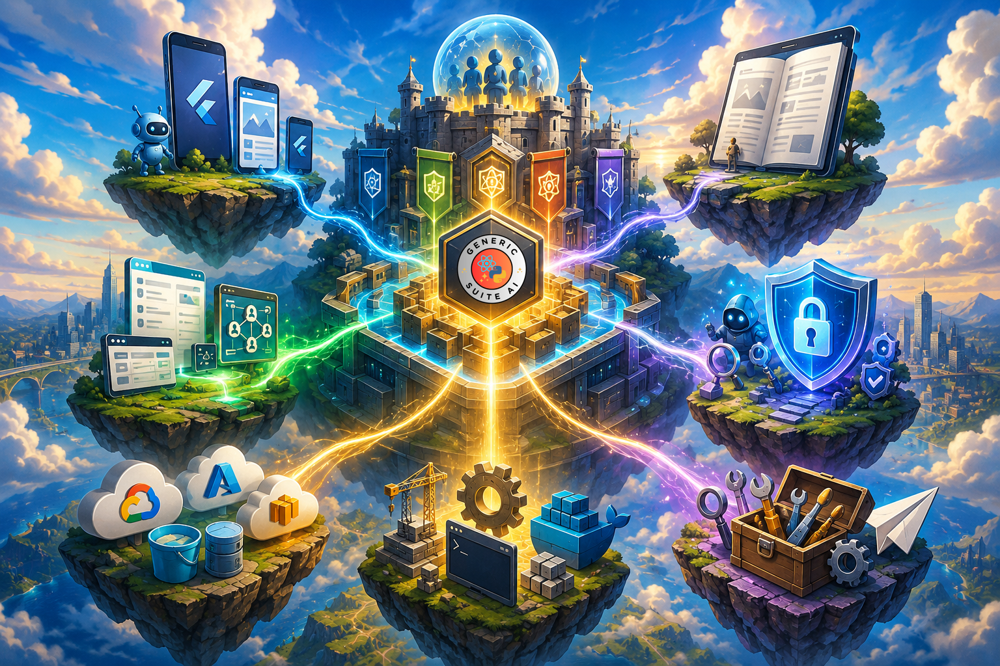

# Desbloquea el poder full-stack con Generic Suite (GS)

¿Alguna vez te has encontrado copiando el mismo código útil y común de una aplicación a otra una y otra vez?

¿No crees que construir una aplicación full-stack es demasiado complejo?

GenericSuite (GS) es un marco de código abierto para construir aplicaciones con mejoras impulsadas por IA. Define tu aplicación en archivos JSON. Obtén web, móvil, API de backend y servicios MCP listos para desplegar y escalar.

Se basa en el paradigma de programación genérica (principio DRY) y permite definir la estructura del menú de la aplicación, esquemas de bases de datos, formularios de entrada de datos, endpoints de API, autenticación y autorización de usuarios mediante archivos de configuración JSON.

El resultado es una aplicación completa lista para desplegar y escalar:

- El frontend web está construido con ReactJs
- Las aplicaciones móviles están construidas con Flutter (compatibles con iOS, Android, Windows, macOS y web)
- Las APIs de backend están construidas con Python y el framework de tu elección (FastAPI, Flask o Chalice)
- El Servidor MCP está construido con Python y FastMCP
- Soporta los principales proveedores de nube para despliegue (AWS, GCP, Azure)
- Soporta los principales motores de base de datos (MongoDB, DynamoDB, PostgreSQL, MySQL, Supabase)
- Las características de IA pueden estar potenciadas por Claude, OpenAI, Gemini, AWS Bedrock, Google Vertex AI, Hugging Face, Ollama, etc.

Ya sea que estés construyendo APIs robustas, bases de datos escalables o interfaces de usuario dinámicas, GS ofrece la flexibilidad y eficiencia necesarias para acelerar tus proyectos.

Únete a la creciente comunidad de desarrolladores que usan Generic Suite para potenciar sus proyectos. Explora los repositorios y comienza a construir hoy mismo!

[Notas de la versión](./Releases/index.md) | [Código de ejemplo](./Sample-Code/index.md) | [Repositorios](./repositories.md)

## Comenzar

* [Características Clave](#caracteristicas-clave)
* [¿Por qué elegir Generic Suite?](#por-que-elegir-generic-suite)
* [¿Para qué sirve Generic Suite?](#para-que-sirve-generic-suite)
* [El Núcleo de Generic Suite](#el-nucleo-de-generic-suite)
* [La IA de Generic Suite](#la-ia-de-generic-suite)
* [Código de ejemplo](#codigo-de-ejemplo)
* [Repositorios](#repositorios)
* [Lanzamientos](#lanzamientos)
* [Presentación](#presentacion)
* [Publicaciones](#publicaciones)
* [Desarrollo Frontend](./Frontend-Development/index.md)
* [Desarrollo Backend](./Backend-Development/index.md)
* [Desarrollo Móvil](./Mobile-Development/index.md)
* [Guía de Configuración](./Configuration-Guide/index.md)
* [Historia](./history.md)

## Características Clave

### Núcleo del Framework

* Editor CRUD personalizable, generador de menús y interfaz de inicio de sesión personalizables.
* Generador genérico de bases de datos y endpoints de API para eliminar código redundante.
* Abstracción del framework backend que soporta FastAPI, Flask y Chalice.
* Abstracción de bases de datos para MongoDB, DynamoDB, PostgreSQL, MySQL y Supabase con una sintaxis de consultas unificada.
* Despliegue sencillo con AWS y otros servicios en la nube.

### Desarrollo impulsado por IA

* Servidor MCP para abrir las aplicaciones desarrolladas a agentes de IA.
* Endpoint de chatbot de IA con integraciones de OpenAI, LangChain y Hugging Face.
* Visión por computadora, procesamiento de voz y capacidades de texto a voz.
* Web scraping, herramientas de traducción y búsqueda vectorial para un manejo avanzado de datos.

### Habilidades IA

* Colección de Habilidades IA de GenericSuite: un conjunto de habilidades de agente de IA que construyen una aplicación completa de GenericSuite — frontend React, backend FastAPI, CRUD impulsado por JSON, asistente de IA y servidor MCP — a partir de una conversación.

### Seguridad

* Colección de Habilidades de Seguridad de GenericSuite: un conjunto de habilidades de agentes de IA y scripts para detectar y responder a amenazas de seguridad, vulnerabilidades y problemas de cumplimiento.

### DevOps y Despliegue sin Esfuerzo

* Despliegues en producción, QA, staging y demo con OpenTofu (IaC) y CloudFormation (AWS).
* Soporte para múltiples plataformas de despliegue en la nube: AWS, Azure, GCP.
* Scripts GitOps preconfigurados para entornos Kubernetes, Docker y VPS.
* Configuraciones de servicio de IA locales, incluyendo OLLAMA, WebUI, Stable Diffusion y N8N.
* Documentación integral y mejores prácticas a través de Generic Suite Basecamp.

### GSAM (Generador de Aplicaciones de Generic Suite)

* Ideación asistida por IA para el desarrollo de aplicaciones, generación de código y estructuración de bases de datos.
* Generación de imágenes y vídeos usando modelos de IA de vanguardia.
* Presentaciones de apps impulsadas por IA, sugerencias de nombres y ingeniería de prompts.

## ¿Por qué elegir Generic Suite?

* Integración full-stack sin fisuras: desarrolla aplicaciones más rápido con una biblioteca unificada para frontend y backend, reduciendo código redundante y asegurando consistencia.
* Eficiencia impulsada por IA: aprovecha las capacidades de IA integradas para mejorar la automatización, generar contenido y optimizar el desarrollo de software.
* Personalizable y escalable: adapta el framework a tus necesidades específicas, con soporte para múltiples frameworks de programación, bases de datos y plataformas de despliegue.
* Flujo de desarrollo acelerado: utilidades preconstruidas y herramientas de automatización ahorran tiempo, permitiéndote centrarte en la innovación en lugar de tareas repetitivas.
* Compatibilidad multiplataforma: ya sea que trabajes con FastAPI, Flask, Chalice, MongoDB, DynamoDB, PostgreSQL, MySQL, Supabase, GS se adapta a tu pila tecnológica sin esfuerzo.

## ¿Para qué sirve Generic Suite?

GenericSuite es una biblioteca de desarrollo diseñada para agilizar flujos de trabajo de frontend, backend, móvil y IA, permitiendo un desarrollo rápido de aplicaciones con mejoras impulsadas por IA. Cuenta con un conjunto de utilidades hechas con ReactJS, Flutter y Python.

Está compuesto por un [Núcleo de Generic Suite](#el-nucleo-de-generic-suite), que es el núcleo de todos los elementos de la suite, extensiones como [la IA de Generic Suite](#la-ia-de-generic-suite), [Generic Suite Móvil](#genericsuite-movil), y herramientas auxiliares como [Operaciones GitOps de Generic Suite](#operaciones-del-servidor), [Habilidades de IA de GenericSuite](#habilidades-de-ia-de-genericsuite), y [Generador de Apps de Generic Suite](#gsam-el-generador-de-aplicaciones-de-generic-suite).

{ .center }

## La IA de Generic Suite

La IA de Generic Suite es una extensión para ayudar a desarrollar Apps que implementan IA.

Características:

* Endpoint de Agente IA para implementar conversaciones tipo chatbot NLP.
* Modelos OpenAI GPT, Google Gemini, Anthropic Claude, Meta Llama, Hugging Face, xAI, IBM WatsonX y muchos otros manejando.
* API de OpenAI, API de Google, API de Anthropic, Hugging Face, Together AI, OpenRuter, API de IA/ML, Ollama, Clarifai y otros proveedores de LLM.
* Visión por computadora (OpenAI GPT4 Vision, Google Gemini Vision, Clarifai Vision).
* Procesamiento de voz a texto (OpenAI Whisper, Clarifai Audio Models).
* Texto a voz (OpenAI TTS-1, Clarifai Audio Models).
* Generador de imágenes (OpenAI DALL-E 3, Google Gemini Image, Clarifai Image Models).
* Indexadores vectoriales (FAISS, Chroma, Clarifai, Vectara, Weaviate, MongoDBAtlasVectorSearch).
* Embeddings (OpenAI, Hugging Face, Bedrock, Cohere, Ollama, Clarifai).
* Herramienta de búsqueda web.
* Rastrado y análisis de páginas web.
* Lectores de JSON, PDF, Git y YouTube.
* Herramientas de traducción de idiomas.
* Chats almacenados en la base de datos.
* Atributos de Plan de usuario, clave API de OpenAI y nombre de modelo en el perfil de usuario, para permitir que usuarios del plan gratuito usen modelos a su propio costo.

Documentación y repositorios:

* :fontawesome-brands-react:{ .react } [IA de GenericSuite (versión frontend) para React.js](./Frontend-Development/GenericSuite-AI/index.md)
* :fontawesome-brands-python:{ .python } [IA de GenericSuite (versión backend) para Python](./Backend-Development/GenericSuite-AI/index.md)
* :fontawesome-brands-linux:{ .linux } [Scripts de GenericSuite (versión backend)](./Backend-Development/GenericSuite-Scripts/index.md)
* Repositorios: [Frontend](./repositories.md#frontend), [Backend](./repositories.md#backend)
* Paquetes: [PyPI y NPMJS](./repositories.md#published-packages)

### Generic Suite Móvil

Características:

* Igual que [el Núcleo de Generic Suite](#el-nucleo-de-generic-suite) pero para el constructor de apps móviles.
* Desarrollado con Flutter para iOS, Android, Windows, macOS y web.

Documentación y repositorios:

* :fontawesome-brands-flutter:{ .flutter } [GenericSuite Mobile para Flutter](./Mobile-Development/index.md)
* Repositorios: [Móvil](./repositories.md#mobile)

### Habilidades de IA de GenericSuite Agent

La colección de Habilidades de IA de GenericSuite Agent es una colección de plugins Claude Skills para el ecosistema GenericSuite. Su pieza central es el **app-builder suite** (`gs-app-builder-suite`): un conjunto de habilidades de agente de IA que construyen una aplicación completa de GenericSuite — frontend React, backend FastAPI, CRUD impulsado por JSON, asistente de IA y servidor MCP — a partir de una conversación.

Documentación y repositorios:

* :fontawesome-brands-openai:{ .openai } [Habilidades de IA del GenericSuite Agent](./ai-skills.md)
* [Repositorios](./repositories.md#ai)

### GSAM: El Generador de Aplicaciones de Generic Suite

El **Generador de Aplicaciones de Generic Suite (GSAM)** es la herramienta de IA para enriquecer la ideación del desarrollo de software y probar modelos de IA, proveedores de LLM y sus características. También permite generar descripciones, estructuras de bases de datos, imágenes, videos o respuestas a partir de un prompt de texto, y generar código inicial para ser utilizado con la biblioteca de Generic Suite.

Repositorio:

* :fontawesome-brands-python:{ .python } [Generador de Aplicaciones GenericSuite](https://github.com/tomkat-cr/genericsuite-app-maker)

<!--
### Equipo de Desarrollo de Software Asistido por IA

El equipo de Desarrollo de Software Autodirigido de Generic Suite (ASDT) proporciona un equipo de entidades autónomas diseñadas para resolver problemas de desarrollo de software usando IA para tomar decisiones, aprender de las interacciones y adaptarse a condiciones cambiantes sin intervención humana.

Repositorio:

* :fontawesome-brands-python:{ .python } [Equipo de Desarrollo de Software Asistido por IA de GenericSuite](https://github.com/tomkat-cr/genericsuite-asdt-be)
-->
## Seguridad

Conjunto de Seguridad de GenericSuite es una suite de auditoría de seguridad y preparación para producción para repositorios de software y entornos de desarrollo. Proporciona **un conjunto de habilidades especializadas de IA** respaldadas por scripts de la biblioteca estándar de Python 3 sin dependencias.

Ya sea usado de forma interactiva a través de asistentes de codificación IA (**Claude Code**, **Google Antigravity**, **Cursor**, **Windsurf**, etc.) o directamente como herramientas CLI independientes en pipelines de CI/CD, este paquete ayuda a los desarrolladores a auditar dependencias de la cadena de suministro, fijar referencias de contenedores, eliminar Acciones de GitHub no fijadas y verificar la preparación del proyecto antes del despliegue en producción.

Documentación y repositorios:

* :fontawesome-brands-openai:{ .openai } [Habilidades de Seguridad de GenericSuite](./security.md)
* [Repositorios](./repositories.md#security)

## Operaciones del Servidor

El **Generic Suite Gitops** proporciona los scripts y configuraciones necesarias para desplegar en varias plataformas (servidores de desarrollo locales, VPS) usando tecnologías de orquestación como Kubernetes, y gestionar artefactos y repositorios con Docker y GitHub.

Documentación y repositorios:

* Guía de Despliegue: [OpenTofu (IaC) Deployment Guide](./Deployment-Guide/opentofu.md)
* [Repositorios](./repositories.md#platform)

## Repositorios

Haz clic aquí para revisar los repos Git, los paquetes NPMJS y PyPI.

## Documentación

* Principal: [https://genericsuite.carlosjramirez.com](https://genericsuite.carlosjramirez.com)
* Espejo: [https://genericsuite.readthedocs.io](https://genericsuite.readthedocs.io)
* Aplicación móvil (únete al programa de pruebas para probarla): [Google Play Store](https://play.google.com/apps/internaltest/4701425955610073424)

## Código de ejemplo

Tenemos un [ExampleApp](../code/exampleapp/README.md) para mostrarte cómo usar las bibliotecas de GenericSuite.

    

[ExampleApp](../code/exampleapp/README.md) es una aplicación de ejemplo completa construida como un monorepo usando Turborepo y pnpm. Esto proporciona un plano práctico y del mundo real para que los desarrolladores aprendan y aceleren sus propios proyectos. Hay un frontend en React y backends en Python, utilizando los 3 marcos principales: FastAPI, Flask y Chalice.

    

También disponemos de una [Plantilla de FastAPI](../code/fastapitemplate/README.md) para ayudarte a empezar con backends basados en FastAPI.

Consulta la sección [Código de muestra](./Sample-Code/index.md) para obtener más información.

## Lanzamientos

Puedes encontrar el registro detallado de cambios de cada lanzamiento [aquí](./Releases/index.md).

Nos enorgullece anunciar el [Lanzamiento GenericSuite 2026-08-30 - v1.0.0](./Releases/GS_Release_2026-08-30_Changelog.md)

## Presentación

Inglés:

* [Introduction to Generic Suite](https://raw.githubusercontent.com/tomkat-cr/genericsuite-basecamp/main/mkdocs_root/en/documents/GS_Presentation_EN_V2.pdf)

Español:

* [Introducción a Generic Suite](https://raw.githubusercontent.com/tomkat-cr/genericsuite-basecamp/main/mkdocs_root/es/documents/GS_Presentation_SP_V2.pdf)

## Publicaciones

X: [@genericsuitelib](https://twitter.com/genericsuitelib)

Inglés:

* [https://www.carlosjramirez.com/en/genericsuite/](https://www.carlosjramirez.com/en/genericsuite/)

Español:

* [https://www.carlosjramirez.com/genericsuite-es/](https://www.carlosjramirez.com/genericsuite-es/)

## Licencia

Generic Suite es software de código abierto licenciado bajo la licencia [MIT](https://github.com/tomkat-cr/genericsuite-basecamp/blob/main/LICENSE).

## Créditos

Este proyecto es desarrollado y mantenido por [Carlos Ramirez](https://www.carlosjramirez.com). Para más información o para contribuir al proyecto, visite [GenericSuite en GitHub](https://github.com/stars/tomkat-cr/lists/genericsuite).

## Política de Privacidad

[Haz clic aquí](./privacy-policy.md) para revisar la política de privacidad.

¡Feliz codificación!